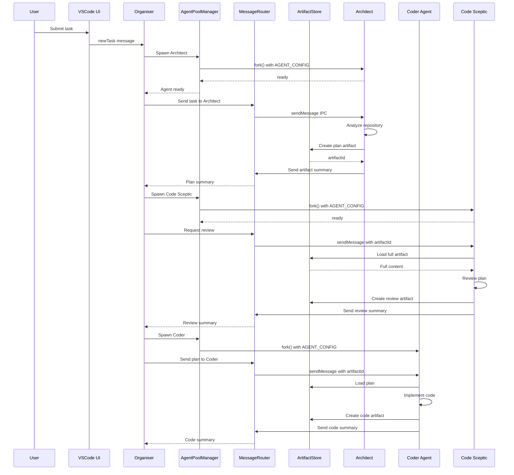
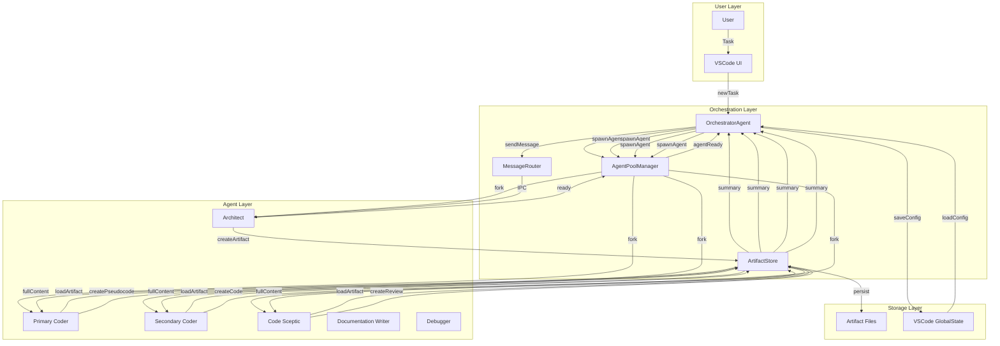
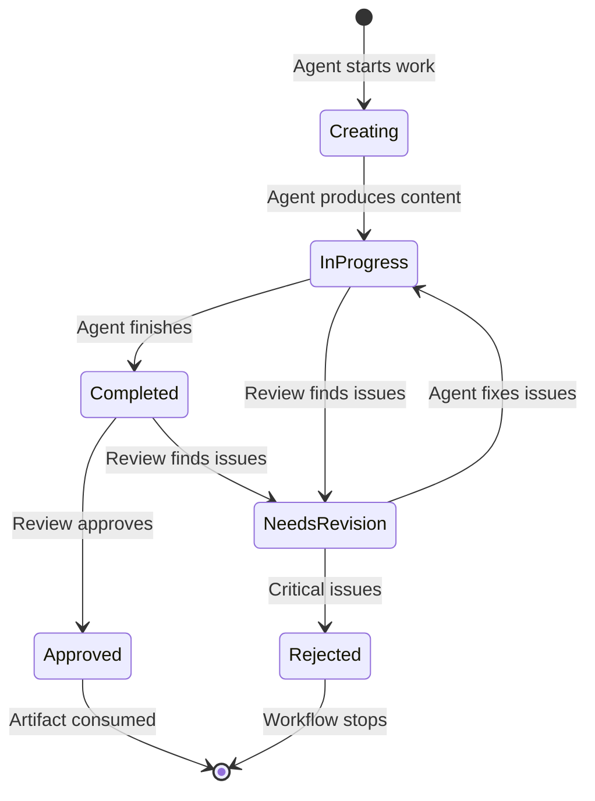
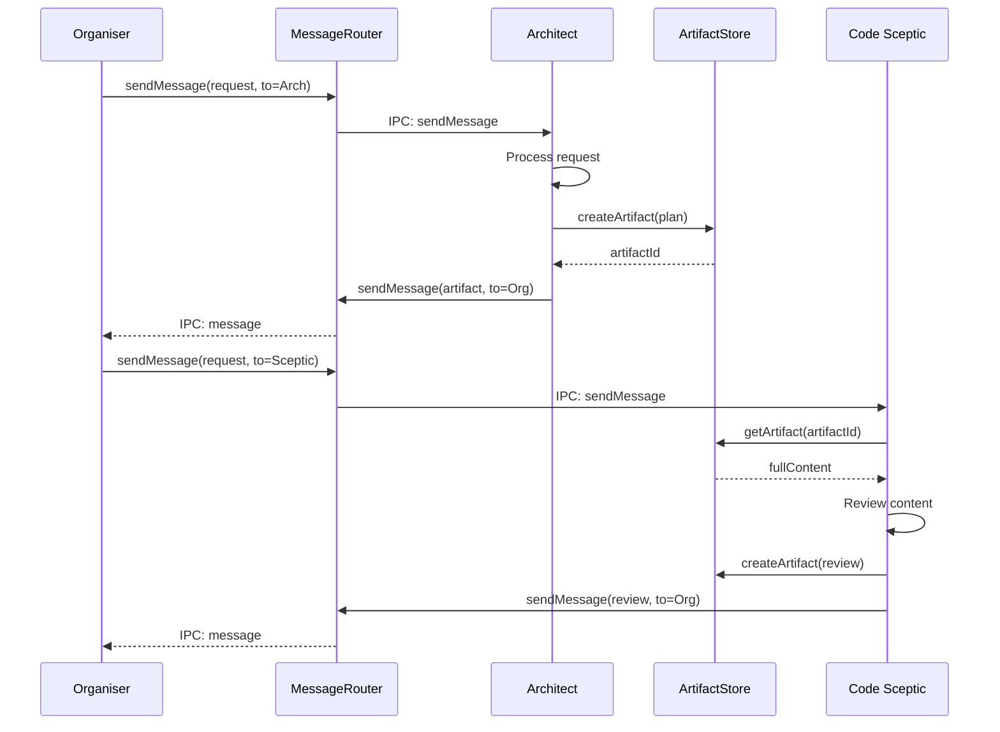
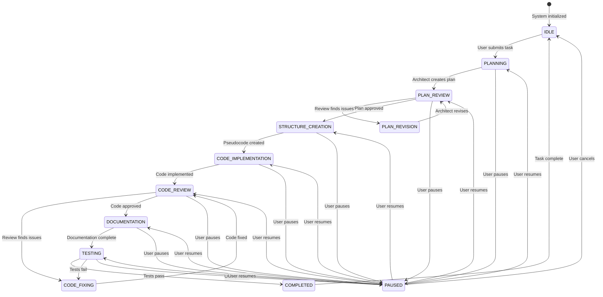
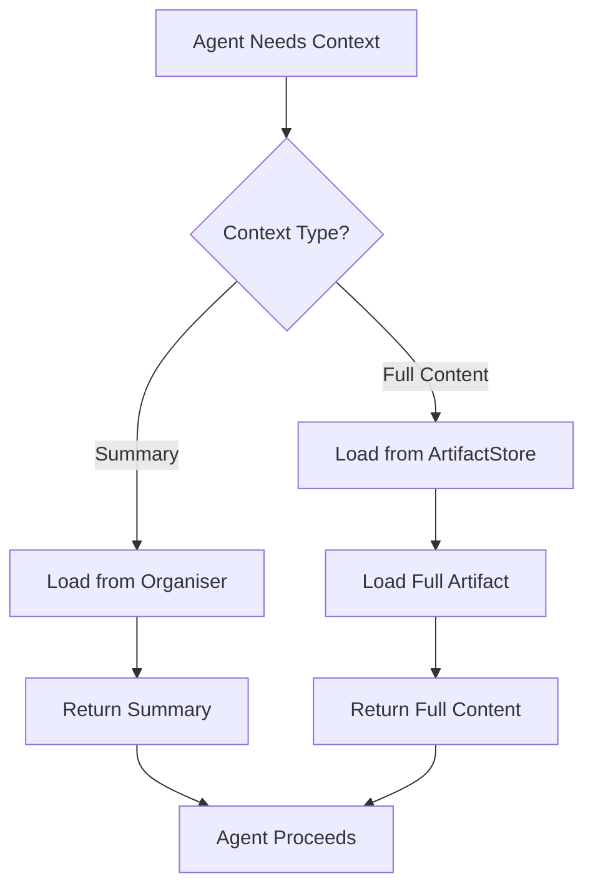

# Multi-Agent Orchestration System - Architectural Documentation

## Executive Summary

The Multi-Agent Orchestration System extends Kilo Code to support multiple AI agents working concurrently on complex development tasks. The system is coordinated by an "Organiser" agent that maintains minimal context to enable management of long-running tasks without hitting context window limits.

### Key Objectives

1. **Concurrent Agent Execution**: Run multiple agents simultaneously, each with different provider/model configurations
2. **Dynamic Role Assignment**: Users configure provider profiles through UI and assign them to any role
3. **Minimal Context Strategy**: Organiser holds only summaries, not full artifact content
4. **Flexible Mode Changes**: Any agent can request mode changes, not just Architect
5. **Artifact-Based Communication**: Agents communicate through structured artifact exchange

### Primary Benefits

- Extended task management without context overflow
- Cost optimization through strategic model assignment
- Specialization: different models excel at different tasks
- Parallel processing across multiple files
- Quality assurance through dedicated review agents
- User flexibility in model experimentation

### Research-Based Design

This architecture is based on research of three leading multi-agent frameworks:

- **CrewAI**: Hierarchical process pattern with a central coordinator
- **LangChain**: Subagents coordination model with message passing
- **MetaGPT**: Software development workflow with role-based agents

The implementation follows CrewAI's hierarchical orchestration with LangChain's subagents pattern, validated by MetaGPT's software development approach.

---

## Architecture Overview

### High-Level System Design

```mermaid
graph TB
    subgraph "User Interface"
        UI[VSCode Extension UI]
        Settings[Agent Roles Settings]
    end

    subgraph "Orchestration Layer"
        Organiser[Organiser Agent]
        AgentPool[AgentPoolManager]
        MessageRouter[MessageRouter]
        ArtifactStore[ArtifactStore]
        ConfigManager[OrchestrationConfigManager]
    end

    subgraph "Agent Runtime"
        Runtime[Agent Runtime Process]
        ExtensionHost[ExtensionHost Mock]
    end

    subgraph "Working Agents"
        Architect[Architect Agent]
        Coder1[Primary Coder]
        Coder2[Secondary Coder]
        Sceptic[Code Sceptic]
        Commenter[Documentation Writer]
        Debugger[Debugger Agent]
    end

    subgraph "Infrastructure"
        Registry[AgentRegistry]
        ProcessHandler[RuntimeProcessHandler]
        ContextProxy[ContextProxy]
        ProviderManager[ProviderSettingsManager]
    end

    UI -->|User Task| Organiser
    Settings -->|Role Config| ConfigManager
    ConfigManager -->|Provider Profiles| AgentPool

    Organiser -->|Spawn/Manage| AgentPool
    AgentPool -->|fork()| Runtime
    Runtime -->|IPC| ProcessHandler
    ProcessHandler -->|Session Tracking| Registry

    Organiser -->|Route Messages| MessageRouter
    MessageRouter -->|IPC| Runtime
    Runtime -->|Extension Messages| ExtensionHost

    Architect -->|Artifacts| ArtifactStore
    Coder1 -->|Artifacts| ArtifactStore
    Coder2 -->|Artifacts| ArtifactStore
    Sceptic -->|Reviews| ArtifactStore
    Commenter -->|Documentation| ArtifactStore
    Debugger -->|Test Results| ArtifactStore

    Organiser -->|Summaries| ArtifactStore
    ArtifactStore -->|Full Content| Runtime

    ContextProxy -->|Config| ProviderManager
    ProviderManager -->|Provider Profiles| ConfigManager
```

### Component Interaction Flow



---

## Component Architecture

### 1. AgentPoolManager

**Location**: `src/core/kilocode/agent-manager/orchestration/AgentPoolManager.ts`

**Purpose**: Spawns and manages multiple agent instances, maintaining the agent registry and handling lifecycle operations.

**Key Responsibilities**:

- Spawn agent processes using [`RuntimeProcessHandler.spawnProcess()`](src/core/kilocode/agent-manager/RuntimeProcessHandler.ts:293)
- Track active agents with unique IDs
- Manage agent lifecycle (create, pause, resume, terminate)
- Enforce maximum concurrent agent limits
- Handle agent health monitoring

**Updating Signals**:

- User starts workflow → `initialize()` called
- New task requires agent → `spawnAgent()` triggered
- Agent health check interval → `setupHealthMonitoring()` runs every 10 seconds
- Agent becomes unhealthy → `handleUnhealthyAgent()` triggered

**Data Flow**:

```
User Task → OrchestrationConfigManager → AgentPoolManager
                              ↓
                    Role Assignments & Provider Profiles
                              ↓
                    AgentConfig (via AGENT_CONFIG env var)
                              ↓
                    fork() → Agent Runtime Process
                              ↓
                    AgentInstance (tracked in Map)
```

**Dependencies**:

- `OrchestrationConfigManager` - Gets role assignments and provider profiles
- `MessageRouter` - Routes messages to/from agents
- `RuntimeProcessHandler` - Spawns agent processes
- `AgentRegistry` - Tracks agent sessions

**Calls**:

- `configManager.getRoleAssignments()` - Get configured roles
- `configManager.getProviderProfile(id)` - Get provider settings
- `configManager.validateConfiguration()` - Validate before spawning
- `messageRouter.routeMessage()` - Route agent messages
- `processHandler.spawnProcess()` - Spawn agent process

**TypeScript Interface**:

```typescript
/**
 * Configuration for spawning an agent
 */
export interface AgentSpawnConfig {
	/** Unique identifier for this agent instance */
	agentId: string

	/** Role this agent will perform (e.g., "architect", "coder") */
	role: AgentRole

	/** Provider profile to use for this agent */
	providerProfile: string

	/** Mode slug for the agent (e.g., "code", "architect", "debug") */
	mode: string

	/** Workspace directory */
	workspace: string

	/** Initial task/prompt for the agent */
	task?: string

	/** Whether this agent should auto-approve operations */
	autoApprove?: boolean

	/** Custom modes to pass to the agent */
	customModes?: ModeConfig[]

	/** Session ID if resuming an existing session */
	sessionId?: string
}

/**
 * Agent instance information
 */
export interface AgentInstance {
	/** Unique agent identifier */
	agentId: string

	/** Role this agent performs */
	role: AgentRole

	/** Mode the agent is running in */
	mode: string

	/** Provider profile being used */
	providerProfile: string

	/** Current status of the agent */
	status: "spawning" | "ready" | "busy" | "paused" | "stopped" | "error"

	/** Child process reference */
	process?: ChildProcess

	/** Session ID if agent has an active session */
	sessionId?: string

	/** Timestamp when agent was spawned */
	spawnedAt: number

	/** Last activity timestamp */
	lastActivityAt: number

	/** Error message if agent is in error state */
	error?: string
}

/**
 * Agent pool manager for orchestrating multiple agents
 */
export class AgentPoolManager {
	private agents: Map<string, AgentInstance> = new Map()
	private readonly maxConcurrentAgents: number
	private readonly processHandler: RuntimeProcessHandler
	private readonly registry: AgentRegistry

	constructor(processHandler: RuntimeProcessHandler, registry: AgentRegistry, maxConcurrentAgents: number = 5) {
		this.processHandler = processHandler
		this.registry = registry
		this.maxConcurrentAgents = maxConcurrentAgents
	}

	/**
	 * Spawn a new agent instance
	 */
	async spawnAgent(config: AgentSpawnConfig): Promise<string> {
		// Check concurrent limit
		if (this.getActiveAgentCount() >= this.maxConcurrentAgents) {
			throw new Error(`Maximum concurrent agents (${this.maxConcurrentAgents}) reached`)
		}

		// Get provider settings from profile
		const providerSettings = await this.getProviderSettings(config.providerProfile)

		// Build agent config for RuntimeProcessHandler
		const agentConfig = {
			workspace: config.workspace,
			providerSettings,
			mode: config.mode,
			autoApprove: config.autoApprove ?? false,
			sessionId: config.sessionId,
			customModes: config.customModes,
		}

		// Spawn the agent process
		this.processHandler.spawnProcess(
			"", // cliPath ignored for RuntimeProcessHandler
			config.workspace,
			config.task || "",
			agentConfig,
			(sessionId, event) => this.handleAgentEvent(config.agentId, sessionId, event),
		)

		// Track the agent
		const instance: AgentInstance = {
			agentId: config.agentId,
			role: config.role,
			mode: config.mode,
			providerProfile: config.providerProfile,
			status: "spawning",
			spawnedAt: Date.now(),
			lastActivityAt: Date.now(),
		}

		this.agents.set(config.agentId, instance)

		return config.agentId
	}

	/**
	 * Get an agent instance by ID
	 */
	getAgent(agentId: string): AgentInstance | undefined {
		return this.agents.get(agentId)
	}

	/**
	 * Get all active agents
	 */
	getActiveAgents(): AgentInstance[] {
		return Array.from(this.agents.values()).filter((a) => a.status === "ready" || a.status === "busy")
	}

	/**
	 * Get count of active agents
	 */
	getActiveAgentCount(): number {
		return this.getActiveAgents().length
	}

	/**
	 * Pause an agent
	 */
	async pauseAgent(agentId: string): Promise<void> {
		const agent = this.agents.get(agentId)
		if (!agent) {
			throw new Error(`Agent ${agentId} not found`)
		}

		// Send pause message via IPC
		if (agent.process) {
			agent.process.send({ type: "pause" })
		}

		agent.status = "paused"
		agent.lastActivityAt = Date.now()
	}

	/**
	 * Resume a paused agent
	 */
	async resumeAgent(agentId: string): Promise<void> {
		const agent = this.agents.get(agentId)
		if (!agent) {
			throw new Error(`Agent ${agentId} not found`)
		}

		// Send resume message via IPC
		if (agent.process) {
			agent.process.send({ type: "resume" })
		}

		agent.status = "ready"
		agent.lastActivityAt = Date.now()
	}

	/**
	 * Terminate an agent
	 */
	async terminateAgent(agentId: string): Promise<void> {
		const agent = this.agents.get(agentId)
		if (!agent) {
			throw new Error(`Agent ${agentId} not found`)
		}

		// Send shutdown message via IPC
		if (agent.process) {
			agent.process.send({ type: "shutdown" })
		}

		agent.status = "stopped"
		agent.lastActivityAt = Date.now()
	}

	/**
	 * Handle events from agent processes
	 */
	private handleAgentEvent(agentId: string, sessionId: string, event: StreamEvent): void {
		const agent = this.agents.get(agentId)
		if (!agent) return

		agent.lastActivityAt = Date.now()

		// Update agent status based on events
		if (event.type === "session_created") {
			agent.status = "ready"
			agent.sessionId = sessionId
		} else if (event.type === "complete") {
			agent.status = "ready"
		} else if (event.type === "error") {
			agent.status = "error"
			agent.error = event.error?.message
		}
	}

	/**
	 * Get provider settings from profile name
	 */
	private async getProviderSettings(profileName: string): Promise<ProviderSettings> {
		// This will integrate with ProviderSettingsManager
		// For now, return a placeholder
		return {} as ProviderSettings
	}
}
```

### 2. MessageRouter

**Location**: `src/core/kilocode/agent-manager/orchestration/MessageRouter.ts`

**Purpose**: Implements inter-agent communication protocol with message queuing, routing, and pub/sub patterns.

**Key Responsibilities**:

- Route messages between agents via IPC
- Implement message queuing for sequential tasks
- Provide pub/sub pattern for agent coordination
- Handle message validation and transformation
- Track message delivery and acknowledgments

**Updating Signals**:

- Agent sends message → `routeMessage()` triggered
- Agent subscribes to messages → `subscribe()` called
- Request/response pattern → `sendRequest()` with correlation ID
- Message queue processing → `startProcessing()` runs every 100ms

**Data Flow**:

```
Agent A → sendMessage() → MessageRouter → routeMessage()
                                      ↓
                              Message Queue (if queued)
                                      ↓
                              Subscribers (via subscribe())
                                      ↓
                              Agent B (recipient)
                                      ↓
                              Response (if request)
                                      ↓
                              Request Callback (via correlationId)
```

**Dependencies**:

- `EventEmitter` - Base class for pub/sub pattern
- `AgentInstance` - Message senders/receivers

**Calls**:

- `subscribe(recipientId, handler)` - Register message handler
- `routeMessage(message)` - Route message to recipient(s)
- `sendRequest(from, to, payload, timeout)` - Send request and wait for response
- `sendResponse(from, to, correlationId, response)` - Send response to request
- `handleResponse(message)` - Process response messages
- `getMessageLog()` - Get message history for debugging

**TypeScript Interface**:

```typescript
/**
 * Message types for inter-agent communication
 */
export type MessageType =
	| "artifact" // Agent produced an artifact
	| "request" // Request for another agent to perform work
	| "status" // Status update from agent
	| "review" // Review feedback
	| "control" // Control messages (pause, resume, etc.)

/**
 * Inter-agent message structure
 */
export interface AgentMessage {
	/** Unique message identifier */
	id: string

	/** Agent ID that sent this message */
	from: string

	/** Target agent ID (or "organiser" for coordinator) */
	to: string

	/** Message type */
	type: MessageType

	/** Message payload */
	payload: AgentMessagePayload

	/** Timestamp when message was created */
	timestamp: number

	/** Correlation ID for request/response pairs */
	correlationId?: string

	/** Priority level (higher = more urgent) */
	priority?: number
}

/**
 * Message payload variants
 */
export type AgentMessagePayload =
	| ArtifactMessagePayload
	| RequestMessagePayload
	| StatusMessagePayload
	| ReviewMessagePayload
	| ControlMessagePayload

/**
 * Artifact message payload
 */
export interface ArtifactMessagePayload {
	/** Artifact ID */
	artifactId: string

	/** Artifact type */
	artifactType: ArtifactType

	/** Brief summary for Organiser */
	summary: string

	/** Metadata about the artifact */
	metadata: Record<string, unknown>
}

/**
 * Request message payload
 */
export interface RequestMessagePayload {
	/** Type of work being requested */
	requestType: string

	/** Artifact IDs to work with */
	artifactIds?: string[]

	/** Additional context for the request */
	context?: string

	/** Expected output artifact type */
	expectedOutputType?: ArtifactType
}

/**
 * Status message payload
 */
export interface StatusMessagePayload {
	/** Current status of the agent */
	status: "idle" | "working" | "waiting" | "error"

	/** Current task description */
	currentTask?: string

	/** Progress percentage (0-100) */
	progress?: number

	/** Additional status information */
	info?: Record<string, unknown>
}

/**
 * Review message payload
 */
export interface ReviewMessagePayload {
	/** Artifact ID being reviewed */
	artifactId: string

	/** Review result */
	result: "approved" | "needs-revision" | "rejected"

	/** Review comments */
	comments: string[]

	/** Severity of issues found */
	severity?: "low" | "medium" | "high" | "critical"
}

/**
 * Control message payload
 */
export interface ControlMessagePayload {
	/** Control action */
	action: "pause" | "resume" | "stop" | "restart"

	/** Reason for the control action */
	reason?: string
}

/**
 * Message router for inter-agent communication
 */
export class MessageRouter extends EventEmitter {
	private messageQueue: Map<string, AgentMessage[]> = new Map()
	private pendingResponses: Map<
		string,
		{
			resolve: (value: AgentMessage) => void
			reject: (error: Error) => void
			timeout: NodeJS.Timeout
		}
	> = new Map()
	private messageIdCounter = 0

	constructor() {
		super()
	}

	/**
	 * Send a message to an agent
	 */
	async sendMessage(message: Omit<AgentMessage, "id" | "timestamp">): Promise<void> {
		const fullMessage: AgentMessage = {
			...message,
			id: this.generateMessageId(),
			timestamp: Date.now(),
		}

		// Queue the message for the target agent
		const queue = this.messageQueue.get(message.to) || []
		queue.push(fullMessage)
		this.messageQueue.set(message.to, queue)

		// Emit message event
		this.emit("message", fullMessage)
	}

	/**
	 * Send a request and wait for response
	 */
	async sendRequest(
		from: string,
		to: string,
		payload: RequestMessagePayload,
		timeoutMs: number = 30000,
	): Promise<AgentMessage> {
		const correlationId = this.generateMessageId()

		const message: AgentMessage = {
			id: this.generateMessageId(),
			from,
			to,
			type: "request",
			payload,
			timestamp: Date.now(),
			correlationId,
		}

		// Set up response handler
		const responsePromise = new Promise<AgentMessage>((resolve, reject) => {
			const timeout = setTimeout(() => {
				this.pendingResponses.delete(correlationId)
				reject(new Error(`Request timeout after ${timeoutMs}ms`))
			}, timeoutMs)

			this.pendingResponses.set(correlationId, { resolve, reject, timeout })
		})

		// Send the message
		await this.sendMessage(message)

		return responsePromise
	}

	/**
	 * Get queued messages for an agent
	 */
	getQueuedMessages(agentId: string): AgentMessage[] {
		return this.messageQueue.get(agentId) || []
	}

	/**
	 * Clear queued messages for an agent
	 */
	clearQueue(agentId: string): void {
		this.messageQueue.delete(agentId)
	}

	/**
	 * Handle a response message
	 */
	handleResponse(message: AgentMessage): void {
		if (!message.correlationId) return

		const pending = this.pendingResponses.get(message.correlationId)
		if (pending) {
			clearTimeout(pending.timeout)
			this.pendingResponses.delete(message.correlationId)
			pending.resolve(message)
		}
	}

	/**
	 * Generate a unique message ID
	 */
	private generateMessageId(): string {
		return `msg_${++this.messageIdCounter}_${Date.now()}`
	}
}
```

### 3. IPC Transport Layer

**Location**: `src/core/kilocode/agent-manager/RuntimeProcessHandler.ts` & `packages/agent-runtime/src/process.ts`

**Purpose**: Handles the low-level process communication between the Agent Manager (parent) and Agent Runtime (child).

**Key Responsibilities**:

- Serialize/deserialize messages
- Manage process lifecycle events
- Handle process isolation

**Message Protocol**:

1. **Parent to Agent (`ParentIPCMessage`)**:

    - `sendMessage`: Send `AgentMessage` payload
    - `shutdown`: Graceful termination
    - `injectConfig`: Update configuration
    - `resumeWithHistory`: Resume session

2. **Agent to Parent (`AgentIPCMessage`)**:
    - `ready`: Agent initialized
    - `message`: `AgentMessage` payload
    - `stateChange`: Extension state update
    - `error`: Error reporting
    - `log`: Log forwarding

**Integration with MessageRouter**:

- `MessageRouter` wraps `AgentMessage` in `ParentIPCMessage` type `sendMessage`
- `AgentPoolManager` unwraps `AgentIPCMessage` type `message` and passes `AgentMessage` payload to `MessageRouter`

### 4. ArtifactStore

**Location**: `src/services/kilocode/artifact-store/`

**Purpose**: Separates artifact storage from Organiser context, storing full content separately and providing summaries for coordination.

**Key Responsibilities**:

- Store full artifact content on disk
- Generate and store summaries for Organiser
- Implement lazy loading of full content
- Track artifact metadata and status
- Handle artifact versioning

**Updating Signals**:

- Agent creates artifact → `storeArtifact()` triggered
- Agent updates artifact → `updateArtifact()` triggered
- Organiser needs summary → `getArtifactSummary()` called
- Agent needs full content → `loadArtifactContent()` called (lazy loading)
- Archive old artifacts → `archiveOldArtifacts()` triggered periodically

**Data Flow**:

```
Agent → createArtifact(type, content, metadata)
        ↓
    ArtifactSummarizer.generateSummary()
        ↓
    Artifact (with summary + contentRef)
        ↓
    writeContent(contentRef, fullContent) → Disk
        ↓
    artifactIndex.set(id, artifact)
        ↓
    Organiser ← getArtifactSummary(id) ← summary only
        ↓
    Agent ← loadArtifactContent(id) ← full content (lazy)
```

**Dependencies**:

- `ArtifactSummarizer` - Generates summaries for Organiser context
- `fs/promises` - File system operations
- `path` - Path manipulation

**Calls**:

- `storeArtifact(type, producer, content, metadata)` - Create new artifact
- `updateArtifact(id, content, status, metadata)` - Update existing artifact
- `getArtifactSummary(id)` - Get summary for Organiser
- `getArtifactMetadata(id)` - Get full artifact metadata
- `loadArtifactContent(id)` - Load full content (lazy loading)
- `getArtifactsByType(type)` - Query artifacts by type
- `getArtifactsByProducer(producer)` - Query artifacts by producer
- `getArtifactsByStatus(status)` - Query artifacts by status
- `getOrganiserArtifactContext()` - Get all summaries for Organiser
- `archiveOldArtifacts(olderThanHours)` - Archive old artifacts

**TypeScript Interface**:

```typescript
/**
 * Artifact types
 */
export type ArtifactType =
	| "plan" // Implementation plan from Architect
	| "pseudocode" // File structure and pseudocode from Primary Coder
	| "code" // Actual implementation from Secondary Coder
	| "review" // Review findings from Code Sceptic
	| "documentation" // Documentation from Documentation Writer
	| "test-result" // Test results from Debugger
	| "error" // Error reports

/**
 * Artifact status
 */
export type ArtifactStatus = "in-progress" | "completed" | "needs-revision" | "approved" | "rejected"

/**
 * Artifact metadata
 */
export interface ArtifactMetadata {
	/** Agent ID that produced this artifact */
	producer: string

	/** Role of the producing agent */
	producerRole: AgentRole

	/** Files affected by this artifact */
	filesAffected?: string[]

	/** Agent IDs that have reviewed this artifact */
	reviewedBy?: string[]

	/** Approval status */
	approvalStatus?: "pending" | "approved" | "rejected"

	/** Related artifact IDs (e.g., code artifact based on plan) */
	relatedArtifacts?: string[]

	/** Timestamp when artifact was created */
	createdAt: number

	/** Timestamp when artifact was last modified */
	modifiedAt: number
}

/**
 * Full artifact structure
 */
export interface Artifact {
	/** Unique artifact identifier */
	id: string

	/** Artifact type */
	type: ArtifactType

	/** Current status */
	status: ArtifactStatus

	/** Brief summary for Organiser (max ~50 tokens) */
	summary: string

	/** Full content (stored separately, not in Organiser context) */
	fullContent: string

	/** Artifact metadata */
	metadata: ArtifactMetadata

	/** Version number */
	version: number
}

/**
 * Artifact summary for Organiser context
 */
export interface ArtifactSummary {
	/** Artifact ID */
	id: string

	/** Artifact type */
	type: ArtifactType

	/** Brief summary */
	summary: string

	/** Status */
	status: ArtifactStatus

	/** Producer role */
	producerRole: AgentRole

	/** Files affected count */
	filesAffectedCount?: number
}

/**
 * Artifact store for managing artifacts
 */
export class ArtifactStore {
	private artifacts: Map<string, Artifact> = new Map()
	private readonly storagePath: string

	constructor(storagePath: string) {
		this.storagePath = storagePath
	}

	/**
	 * Create a new artifact
	 */
	async createArtifact(
		type: ArtifactType,
		producer: string,
		producerRole: AgentRole,
		fullContent: string,
		metadata?: Partial<ArtifactMetadata>,
	): Promise<Artifact> {
		const id = this.generateArtifactId(type)
		const summary = await this.generateSummary(type, fullContent)

		const artifact: Artifact = {
			id,
			type,
			status: "in-progress",
			summary,
			fullContent,
			metadata: {
				producer,
				producerRole,
				createdAt: Date.now(),
				modifiedAt: Date.now(),
				...metadata,
			},
			version: 1,
		}

		this.artifacts.set(id, artifact)
		await this.persistArtifact(artifact)

		return artifact
	}

	/**
	 * Get an artifact by ID
	 */
	getArtifact(id: string): Artifact | undefined {
		return this.artifacts.get(id)
	}

	/**
	 * Get artifact summary (for Organiser context)
	 */
	getArtifactSummary(id: string): ArtifactSummary | undefined {
		const artifact = this.artifacts.get(id)
		if (!artifact) return undefined

		return {
			id: artifact.id,
			type: artifact.type,
			summary: artifact.summary,
			status: artifact.status,
			producerRole: artifact.metadata.producerRole,
			filesAffectedCount: artifact.metadata.filesAffected?.length,
		}
	}

	/**
	 * Get all artifact summaries (for Organiser context)
	 */
	getAllSummaries(): ArtifactSummary[] {
		return Array.from(this.artifacts.values()).map((a) => ({
			id: a.id,
			type: a.type,
			summary: a.summary,
			status: a.status,
			producerRole: a.metadata.producerRole,
			filesAffectedCount: a.metadata.filesAffected?.length,
		}))
	}

	/**
	 * Update artifact status
	 */
	async updateArtifactStatus(id: string, status: ArtifactStatus): Promise<void> {
		const artifact = this.artifacts.get(id)
		if (!artifact) {
			throw new Error(`Artifact ${id} not found`)
		}

		artifact.status = status
		artifact.metadata.modifiedAt = Date.now()
		await this.persistArtifact(artifact)
	}

	/**
	 * Update artifact content
	 */
	async updateArtifactContent(id: string, newContent: string): Promise<void> {
		const artifact = this.artifacts.get(id)
		if (!artifact) {
			throw new Error(`Artifact ${id} not found`)
		}

		artifact.fullContent = newContent
		artifact.summary = await this.generateSummary(artifact.type, newContent)
		artifact.version += 1
		artifact.metadata.modifiedAt = Date.now()
		await this.persistArtifact(artifact)
	}

	/**
	 * Add reviewer to artifact
	 */
	async addReviewer(id: string, reviewerId: string): Promise<void> {
		const artifact = this.artifacts.get(id)
		if (!artifact) {
			throw new Error(`Artifact ${id} not found`)
		}

		if (!artifact.metadata.reviewedBy) {
			artifact.metadata.reviewedBy = []
		}
		artifact.metadata.reviewedBy.push(reviewerId)
		await this.persistArtifact(artifact)
	}

	/**
	 * Generate a brief summary from full content
	 */
	private async generateSummary(type: ArtifactType, content: string): Promise<string> {
		// Extract key information based on artifact type
		const lines = content.split("\n").filter((l) => l.trim())

		switch (type) {
			case "plan":
				// First non-empty line is usually the plan title
				return lines[0]?.substring(0, 100) || "Implementation plan"

			case "pseudocode":
				// Count files mentioned
				const fileCount = (content.match(/file:/gi) || []).length
				return `${fileCount} files with pseudocode`

			case "code":
				// Extract file path if present
				const pathMatch = content.match(/\/\/ File: (.+)/)
				return pathMatch ? `Code for ${pathMatch[1]}` : "Code implementation"

			case "review":
				// Count issues found
				const issueCount = (content.match(/issue:/gi) || []).length
				return `${issueCount} issues found in review`

			case "documentation":
				// First line is usually the doc title
				return lines[0]?.substring(0, 100) || "Documentation"

			case "test-result":
				// Extract pass/fail info
				const passMatch = content.match(/(\d+) passed/)
				const failMatch = content.match(/(\d+) failed/)
				if (passMatch || failMatch) {
					return `Tests: ${passMatch?.[1] || 0} passed, ${failMatch?.[1] || 0} failed`
				}
				return "Test results"

			default:
				return content.substring(0, 100)
		}
	}

	/**
	 * Generate a unique artifact ID
	 */
	private generateArtifactId(type: ArtifactType): string {
		return `${type}_${Date.now()}_${Math.random().toString(36).substring(2, 9)}`
	}

	/**
	 * Persist artifact to disk
	 */
	private async persistArtifact(artifact: Artifact): Promise<void> {
		const fs = await import("node:fs/promises")
		const path = await import("node:path")

		const artifactPath = path.join(this.storagePath, `${artifact.id}.json`)
		await fs.writeFile(artifactPath, JSON.stringify(artifact, null, 2))
	}
}
```

### 4. OrchestratorAgent

**Location**: `src/core/kilocode/agent-manager/orchestration/OrchestratorAgent.ts`

**Purpose**: The Organiser agent that coordinates all other agents, maintains minimal context, and manages workflow state.

**Key Responsibilities**:

- Maintain minimal context (task, workflow state, artifact summaries)
- Coordinate agent spawning and task delegation
- Manage workflow state machine transitions
- Route messages between agents
- Handle user interactions

**Updating Signals**:

- User submits task → `startTask()` triggered
- Agent sends message → `handleMessage()` triggered
- Artifact created → `handleArtifactMessage()` → `transitionState()`
- Status update received → `handleStatusUpdate()`
- Error received → `handleAgentError()`
- Workflow step completes → `executeWorkflowStep()` → next state

**Data Flow**:

```
User Task → startTask()
        ↓
    OrganiserContext (minimal: task, state, summaries)
        ↓
    transitionState(PLANNING)
        ↓
    agentPool.getAgent("architect")
        ↓
    messageRouter.sendRequest(architect)
        ↓
    Architect → ArtifactStore.storeArtifact()
        ↓
    ArtifactStore → getArtifactSummary()
        ↓
    Organiser ← summary (NOT full content)
        ↓
    makeWorkflowDecision(artifact) → LLM
        ↓
    transitionState(nextState)
```

**Dependencies**:

- `AgentPoolManager` - Spawns and manages agents
- `MessageRouter` - Routes messages to/from agents
- `ArtifactStore` - Stores and retrieves artifacts
- `OrchestrationConfigManager` - Gets role configurations
- `WorkflowStateMachine` - Validates state transitions
- `LLMProvider` - Makes workflow decisions

**Calls**:

- `startTask(userTask)` - Start new workflow
- `handleMessage(message)` - Process incoming messages
- `handleAgentResponse(message)` - Process agent responses
- `handleArtifactMessage(message)` - Process artifact notifications
- `handleStatusUpdate(message)` - Process status updates
- `handleAgentError(message)` - Process errors
- `transitionState(newState)` - Change workflow state
- `executeWorkflowStep()` - Execute current state's logic
- `delegateToAgent(roleId, task, type, artifacts, timeout)` - Delegate work
- `makeWorkflowDecision(artifact)` - Use LLM to decide next action
- `generateCompletionSummary()` - Generate final summary

**TypeScript Interface**:

```typescript
/**
 * Workflow states
 */
export type WorkflowState =
	| "IDLE"
	| "PLANNING"
	| "PLAN_REVIEW"
	| "PLAN_REVISION"
	| "STRUCTURE_CREATION"
	| "CODE_IMPLEMENTATION"
	| "CODE_REVIEW"
	| "CODE_FIXING"
	| "DOCUMENTATION"
	| "TESTING"
	| "COMPLETED"
	| "PAUSED"

/**
 * Workflow step
 */
export interface WorkflowStep {
	/** Step identifier */
	id: string

	/** Step name */
	name: string

	/** Current state */
	state: WorkflowState

	/** Agent responsible for this step */
	agentId?: string

	/** Required input artifact types */
	inputArtifactTypes: ArtifactType[]

	/** Expected output artifact type */
	outputArtifactType?: ArtifactType

	/** Whether this step is completed */
	completed: boolean

	/** Error message if step failed */
	error?: string
}

/**
 * Organiser context (minimal)
 */
export interface OrganiserContext {
	/** User's original task */
	userTask: string

	/** Current workflow state */
	workflowState: WorkflowState

	/** Artifact summaries (NOT full content) */
	artifacts: ArtifactSummary[]

	/** Agent statuses */
	agentStatuses: Map<string, AgentInstance["status"]>

	/** Current workflow step */
	currentStep: WorkflowStep | null

	/** Mode descriptions */
	modeDescriptions: Map<string, string>

	/** To-do list */
	todoList: Task[]

	/** Workflow history for debugging */
	workflowHistory: WorkflowState[]
}

/**
 * Orchestrator agent class
 */
export class OrchestratorAgent {
	private context: OrganiserContext
	private agentPool: AgentPoolManager
	private messageRouter: MessageRouter
	private artifactStore: ArtifactStore
	private configManager: OrchestrationConfigManager

	constructor(
		agentPool: AgentPoolManager,
		messageRouter: MessageRouter,
		artifactStore: ArtifactStore,
		configManager: OrchestrationConfigManager,
	) {
		this.agentPool = agentPool
		this.messageRouter = messageRouter
		this.artifactStore = artifactStore
		this.configManager = configManager

		this.context = {
			userTask: "",
			workflowState: "IDLE",
			artifacts: [],
			agentStatuses: new Map(),
			currentStep: null,
			modeDescriptions: new Map(),
			todoList: [],
			workflowHistory: [],
		}
	}

	/**
	 * Start a new task
	 */
	async startTask(task: string): Promise<void> {
		this.context.userTask = task
		this.context.workflowState = "PLANNING"
		this.context.workflowHistory.push("PLANNING")

		// Spawn Architect agent
		const architectConfig = await this.configManager.getAgentConfig("architect")
		const architectId = await this.agentPool.spawnAgent({
			agentId: `architect_${Date.now()}`,
			role: "architect",
			providerProfile: architectConfig.providerProfile,
			mode: architectConfig.mode,
			workspace: architectConfig.workspace,
			task,
		})

		// Send task to Architect
		await this.messageRouter.sendMessage({
			from: "organiser",
			to: architectId,
			type: "request",
			payload: {
				requestType: "create_plan",
				context: task,
				expectedOutputType: "plan",
			},
		})
	}

	/**
	 * Handle message from an agent
	 */
	async handleAgentMessage(message: AgentMessage): Promise<void> {
		// Update agent status
		this.context.agentStatuses.set(message.from, "busy")

		switch (message.type) {
			case "artifact":
				await this.handleArtifactMessage(message)
				break

			case "status":
				await this.handleStatusMessage(message)
				break

			case "review":
				await this.handleReviewMessage(message)
				break

			default:
				console.warn(`Unknown message type: ${message.type}`)
		}

		// Update agent status back to ready
		this.context.agentStatuses.set(message.from, "ready")
	}

	/**
	 * Handle artifact message from agent
	 */
	private async handleArtifactMessage(message: AgentMessage): Promise<void> {
		const payload = message.payload as ArtifactMessagePayload

		// Get artifact summary
		const summary = this.artifactStore.getArtifactSummary(payload.artifactId)
		if (!summary) {
			console.error(`Artifact ${payload.artifactId} not found`)
			return
		}

		// Add to context (summary only, not full content)
		this.context.artifacts.push(summary)

		// Transition workflow state based on artifact type
		await this.transitionWorkflowState(summary.type)
	}

	/**
	 * Handle status message from agent
	 */
	private async handleStatusMessage(message: AgentMessage): Promise<void> {
		const payload = message.payload as StatusMessagePayload

		// Update agent status in context
		this.context.agentStatuses.set(message.from, payload.status)

		// Log status update
		console.log(`Agent ${message.from} status: ${payload.status}`, payload.info)
	}

	/**
	 * Handle review message from agent
	 */
	private async handleReviewMessage(message: AgentMessage): Promise<void> {
		const payload = message.payload as ReviewMessagePayload

		// Update artifact status based on review
		if (payload.result === "approved") {
			await this.artifactStore.updateArtifactStatus(payload.artifactId, "approved")
		} else if (payload.result === "needs-revision") {
			await this.artifactStore.updateArtifactStatus(payload.artifactId, "needs-revision")
		} else {
			await this.artifactStore.updateArtifactStatus(payload.artifactId, "rejected")
		}

		// Transition workflow state
		await this.transitionWorkflowStateBasedOnReview(payload)
	}

	/**
	 * Transition workflow state based on artifact type
	 */
	private async transitionWorkflowState(artifactType: ArtifactType): Promise<void> {
		const currentState = this.context.workflowState

		switch (currentState) {
			case "PLANNING":
				if (artifactType === "plan") {
					this.context.workflowState = "PLAN_REVIEW"
					this.context.workflowHistory.push("PLAN_REVIEW")
					await this.requestPlanReview()
				}
				break

			case "PLAN_REVIEW":
				if (artifactType === "review") {
					this.context.workflowState = "STRUCTURE_CREATION"
					this.context.workflowHistory.push("STRUCTURE_CREATION")
					await this.startStructureCreation()
				}
				break

			case "STRUCTURE_CREATION":
				if (artifactType === "pseudocode") {
					this.context.workflowState = "CODE_IMPLEMENTATION"
					this.context.workflowHistory.push("CODE_IMPLEMENTATION")
					await this.startCodeImplementation()
				}
				break

			case "CODE_IMPLEMENTATION":
				if (artifactType === "code") {
					this.context.workflowState = "CODE_REVIEW"
					this.context.workflowHistory.push("CODE_REVIEW")
					await this.requestCodeReview()
				}
				break

			case "CODE_REVIEW":
				if (artifactType === "review") {
					this.context.workflowState = "DOCUMENTATION"
					this.context.workflowHistory.push("DOCUMENTATION")
					await this.startDocumentation()
				}
				break

			case "DOCUMENTATION":
				if (artifactType === "documentation") {
					this.context.workflowState = "TESTING"
					this.context.workflowHistory.push("TESTING")
					await this.startTesting()
				}
				break

			case "TESTING":
				if (artifactType === "test-result") {
					this.context.workflowState = "COMPLETED"
					this.context.workflowHistory.push("COMPLETED")
				}
				break
		}
	}

	/**
	 * Request plan review from Code Sceptic
	 */
	private async requestPlanReview(): Promise<void> {
		const scepticConfig = await this.configManager.getAgentConfig("code-sceptic")
		const scepticId = await this.agentPool.spawnAgent({
			agentId: `sceptic_${Date.now()}`,
			role: "code-sceptic",
			providerProfile: scepticConfig.providerProfile,
			mode: scepticConfig.mode,
			workspace: scepticConfig.workspace,
		})

		// Get the plan artifact
		const planArtifact = this.context.artifacts.find((a) => a.type === "plan")
		if (!planArtifact) {
			console.error("No plan artifact found")
			return
		}

		// Send review request
		await this.messageRouter.sendMessage({
			from: "organiser",
			to: scepticId,
			type: "request",
			payload: {
				requestType: "review_plan",
				artifactIds: [planArtifact.id],
				expectedOutputType: "review",
			},
		})
	}

	/**
	 * Start structure creation with Primary Coder
	 */
	private async startStructureCreation(): Promise<void> {
		const coderConfig = await this.configManager.getAgentConfig("primary-coder")
		const coderId = await this.agentPool.spawnAgent({
			agentId: `coder1_${Date.now()}`,
			role: "primary-coder",
			providerProfile: coderConfig.providerProfile,
			mode: coderConfig.mode,
			workspace: coderConfig.workspace,
		})

		// Get the plan artifact
		const planArtifact = this.context.artifacts.find((a) => a.type === "plan")
		if (!planArtifact) {
			console.error("No plan artifact found")
			return
		}

		// Send structure creation request
		await this.messageRouter.sendMessage({
			from: "organiser",
			to: coderId,
			type: "request",
			payload: {
				requestType: "create_structure",
				artifactIds: [planArtifact.id],
				expectedOutputType: "pseudocode",
			},
		})
	}

	/**
	 * Start code implementation with Secondary Coder
	 */
	private async startCodeImplementation(): Promise<void> {
		const coderConfig = await this.configManager.getAgentConfig("secondary-coder")
		const coderId = await this.agentPool.spawnAgent({
			agentId: `coder2_${Date.now()}`,
			role: "secondary-coder",
			providerProfile: coderConfig.providerProfile,
			mode: coderConfig.mode,
			workspace: coderConfig.workspace,
		})

		// Get the pseudocode artifact
		const pseudocodeArtifact = this.context.artifacts.find((a) => a.type === "pseudocode")
		if (!pseudocodeArtifact) {
			console.error("No pseudocode artifact found")
			return
		}

		// Send implementation request
		await this.messageRouter.sendMessage({
			from: "organiser",
			to: coderId,
			type: "request",
			payload: {
				requestType: "implement_code",
				artifactIds: [pseudocodeArtifact.id],
				expectedOutputType: "code",
			},
		})
	}

	/**
	 * Request code review from Code Sceptic
	 */
	private async requestCodeReview(): Promise<void> {
		const scepticConfig = await this.configManager.getAgentConfig("code-sceptic")
		const scepticId = await this.agentPool.spawnAgent({
			agentId: `sceptic_${Date.now()}`,
			role: "code-sceptic",
			providerProfile: scepticConfig.providerProfile,
			mode: scepticConfig.mode,
			workspace: scepticConfig.workspace,
		})

		// Get the code artifact
		const codeArtifact = this.context.artifacts.find((a) => a.type === "code")
		if (!codeArtifact) {
			console.error("No code artifact found")
			return
		}

		// Send review request
		await this.messageRouter.sendMessage({
			from: "organiser",
			to: scepticId,
			type: "request",
			payload: {
				requestType: "review_code",
				artifactIds: [codeArtifact.id],
				expectedOutputType: "review",
			},
		})
	}

	/**
	 * Start documentation with Documentation Writer
	 */
	private async startDocumentation(): Promise<void> {
		const docConfig = await this.configManager.getAgentConfig("documentation-writer")
		const docId = await this.agentPool.spawnAgent({
			agentId: `doc_${Date.now()}`,
			role: "documentation-writer",
			providerProfile: docConfig.providerProfile,
			mode: docConfig.mode,
			workspace: docConfig.workspace,
		})

		// Get the code artifact
		const codeArtifact = this.context.artifacts.find((a) => a.type === "code")
		if (!codeArtifact) {
			console.error("No code artifact found")
			return
		}

		// Send documentation request
		await this.messageRouter.sendMessage({
			from: "organiser",
			to: docId,
			type: "request",
			payload: {
				requestType: "write_documentation",
				artifactIds: [codeArtifact.id],
				expectedOutputType: "documentation",
			},
		})
	}

	/**
	 * Start testing with Debugger
	 */
	private async startTesting(): Promise<void> {
		const debuggerConfig = await this.configManager.getAgentConfig("debugger")
		const debuggerId = await this.agentPool.spawnAgent({
			agentId: `debugger_${Date.now()}`,
			role: "debugger",
			providerProfile: debuggerConfig.providerProfile,
			mode: debuggerConfig.mode,
			workspace: debuggerConfig.workspace,
		})

		// Send testing request
		await this.messageRouter.sendMessage({
			from: "organiser",
			to: debuggerId,
			type: "request",
			payload: {
				requestType: "run_tests",
				expectedOutputType: "test-result",
			},
		})
	}

	/**
	 * Transition workflow state based on review result
	 */
	private async transitionWorkflowStateBasedOnReview(payload: ReviewMessagePayload): Promise<void> {
		if (payload.result === "needs-revision") {
			// Go back to implementation for fixes
			this.context.workflowState = "CODE_FIXING"
			this.context.workflowHistory.push("CODE_FIXING")
			await this.requestCodeFixes(payload)
		}
	}

	/**
	 * Request code fixes from Secondary Coder
	 */
	private async requestCodeFixes(payload: ReviewMessagePayload): Promise<void> {
		const coderConfig = await this.configManager.getAgentConfig("secondary-coder")
		const coderId = await this.agentPool.spawnAgent({
			agentId: `coder2_${Date.now()}`,
			role: "secondary-coder",
			providerProfile: coderConfig.providerProfile,
			mode: coderConfig.mode,
			workspace: coderConfig.workspace,
		})

		// Send fix request with review comments
		await this.messageRouter.sendMessage({
			from: "organiser",
			to: coderId,
			type: "request",
			payload: {
				requestType: "fix_code",
				artifactIds: [payload.artifactId],
				context: `Fix issues: ${payload.comments.join("; ")}`,
				expectedOutputType: "code",
			},
		})
	}

	/**
	 * Pause the workflow
	 */
	async pause(): Promise<void> {
		this.context.workflowState = "PAUSED"
		this.context.workflowHistory.push("PAUSED")

		// Pause all active agents
		const activeAgents = this.agentPool.getActiveAgents()
		for (const agent of activeAgents) {
			await this.agentPool.pauseAgent(agent.agentId)
		}
	}

	/**
	 * Resume the workflow
	 */
	async resume(): Promise<void> {
		// Resume all paused agents
		const agents = this.agentPool.getActiveAgents()
		for (const agent of agents) {
			if (agent.status === "paused") {
				await this.agentPool.resumeAgent(agent.agentId)
			}
		}

		// Restore previous workflow state
		const previousState = this.context.workflowHistory[this.context.workflowHistory.length - 2]
		if (previousState) {
			this.context.workflowState = previousState
		}
	}

	/**
	 * Cancel the workflow
	 */
	async cancel(): Promise<void> {
		this.context.workflowState = "IDLE"
		this.context.workflowHistory = []

		// Terminate all agents
		const agents = this.agentPool.getActiveAgents()
		for (const agent of agents) {
			await this.agentPool.terminateAgent(agent.agentId)
		}
	}
}
```

### 5. Role Definitions

**Location**: `src/core/kilocode/agent-manager/orchestration/roles/`

**Purpose**: Define available agent roles, their capabilities, and configuration.

**Updating Signals**:

- User changes role assignment → `updateRoleAssignment()` triggered
- Configuration loaded → `getRoleAssignments()` called
- Validation requested → `validateConfiguration()` called

**Data Flow**:

```
User Settings → OrchestrationConfigManager
                    ↓
            RoleAssignments (roleId → profileId)
                    ↓
            AgentPoolManager.spawnAgent()
                    ↓
            AgentConfig (role + profile)
                    ↓
            Agent Runtime Process
```

**Dependencies**:

- `OrchestrationConfigManager` - Stores role assignments
- `ProviderSettingsManager` - Gets provider profiles

**Calls**:

- `getRoleAssignments()` - Get all role assignments
- `updateRoleAssignment(roleId, profileId, isActive)` - Update assignment
- `getProviderProfile(id)` - Get provider settings
- `validateConfiguration()` - Validate role assignments

### 6. LLMProvider

**Location**: `src/core/kilocode/agent-manager/orchestration/LLMProvider.ts`

**Purpose**: Abstraction over different LLM providers (Anthropic, OpenAI, Google) with tool use support.

**Key Responsibilities**:

- Initialize provider-specific clients
- Complete prompts with different providers
- Support tool use/function calling
- Handle provider-specific response formats

**Updating Signals**:

- Agent needs LLM → `complete()` or `completeWithTools()` called
- Tool use required → `executeToolCalls()` triggered
- Provider configuration changed → Reinitialize client

**Data Flow**:

```
Agent → LLMProvider.complete(prompt)
        ↓
    Provider-specific client (Anthropic/OpenAI/Google)
        ↓
    API Request → Provider
        ↓
    Response → Text/Tool Calls
        ↓
    Agent ← Result
```

**Dependencies**:

- `@anthropic-ai/sdk` - Anthropic API client
- `openai` - OpenAI API client
- `@google/generative-ai` - Google API client

**Calls**:

- `complete(prompt, options)` - Simple text completion
- `completeWithTools(prompt, tools, options)` - Completion with tool use
- `initializeAnthropic()` - Initialize Anthropic client
- `initializeOpenAI()` - Initialize OpenAI client
- `initializeGoogle()` - Initialize Google client
- `executeToolCalls(toolCalls, tools)` - Execute tool functions
- `convertToolsToProviderFormat(tools)` - Convert tools for provider

### 7. OrchestrationConfigManager

**Location**: `src/core/kilocode/agent-manager/orchestration/OrchestrationConfigManager.ts`

**Purpose**: Manages role assignments, provider profiles, and workflow settings.

**Key Responsibilities**:

- Store and load configuration from VS Code globalState
- Manage role assignments (role → provider mapping)
- Manage provider profiles (API keys, models, settings)
- Validate configuration before use
- Export/import configuration

**Updating Signals**:

- User changes settings → `updateRoleAssignment()` or `updateProviderProfile()` called
- Configuration loaded → `getConfiguration()` called
- Validation requested → `validateConfiguration()` called
- Export/import triggered → `exportConfiguration()` or `importConfiguration()` called

**Data Flow**:

```
User Settings → VSCode globalState
                    ↓
            OrchestrationConfigManager
                    ↓
            RoleAssignments + ProviderProfiles
                    ↓
            AgentPoolManager (for spawning)
```

**Dependencies**:

- `vscode.ExtensionContext` - VS Code context for globalState
- `ProviderSettingsManager` - Get existing provider settings

**Calls**:

- `getConfiguration()` - Get full configuration
- `saveConfiguration(config)` - Save configuration
- `getRoleAssignments()` - Get role assignments
- `updateRoleAssignment(roleId, profileId, isActive)` - Update assignment
- `getProviderProfiles()` - Get provider profiles
- `getProviderProfile(id)` - Get specific profile
- `addProviderProfile(profile)` - Add new profile
- `updateProviderProfile(profile)` - Update profile
- `deleteProviderProfile(id)` - Delete profile
- `validateConfiguration()` - Validate configuration
- `isOrchestrationEnabled()` - Check if enabled
- `setOrchestrationEnabled(enabled)` - Enable/disable
- `exportConfiguration()` - Export to JSON
- `importConfiguration(json)` - Import from JSON

**TypeScript Interface**:

```typescript
/**
 * Agent role types
 */
export type AgentRole =
	| "organiser" // Coordinates all agents
	| "architect" // Analyzes repository, creates plans
	| "primary-coder" // Creates file structure and pseudocode
	| "secondary-coder" // Implements actual code
	| "code-sceptic" // Reviews plans and code for issues
	| "documentation-writer" // Writes documentation and comments
	| "debugger" // Runs tests and identifies bugs
	| "custom" // User-defined custom role

/**
 * Role capability
 */
export interface RoleCapability {
	/** Capability name */
	name: string

	/** Capability description */
	description: string

	/** Whether this capability is required for the role */
	required: boolean
}

/**
 * Role definition
 */
export interface RoleDefinition {
	/** Role identifier */
	id: AgentRole

	/** Display name */
	name: string

	/** Role description */
	description: string

	/** Whether this role is required for orchestration */
	required: boolean

	/** Capabilities this role provides */
	capabilities: RoleCapability[]

	/** Input artifact types this role can work with */
	inputArtifactTypes: ArtifactType[]

	/** Output artifact types this role produces */
	outputArtifactTypes: ArtifactType[]

	/** Default mode for this role */
	defaultMode: string

	/** Category for UI grouping */
	category: "coordination" | "planning" | "implementation" | "review" | "support"
}

/**
 * Role configuration (user-assigned)
 */
export interface RoleConfiguration {
	/** Role ID */
	roleId: AgentRole

	/** Whether this role is enabled */
	enabled: boolean

	/** Provider profile assigned to this role */
	providerProfile: string

	/** Mode to use for this role */
	mode: string

	/** Custom role definition (for custom roles) */
	customDefinition?: RoleDefinition
}

/**
 * Predefined role definitions
 */
export const ROLE_DEFINITIONS: Record<AgentRole, RoleDefinition> = {
	organiser: {
		id: "organiser",
		name: "Organiser",
		description: "Coordinates all agents, manages workflow state, and delegates tasks",
		required: true,
		capabilities: [
			{ name: "coordinate_agents", description: "Spawn and manage other agents", required: true },
			{ name: "manage_workflow", description: "Control workflow state transitions", required: true },
			{ name: "route_messages", description: "Route messages between agents", required: true },
		],
		inputArtifactTypes: [],
		outputArtifactTypes: [],
		defaultMode: "architect",
		category: "coordination",
	},

	architect: {
		id: "architect",
		name: "Architect",
		description: "Analyzes repository structure and creates implementation plans",
		required: true,
		capabilities: [
			{ name: "analyze_repository", description: "Read and understand codebase structure", required: true },
			{ name: "create_plan", description: "Generate detailed implementation plans", required: true },
			{ name: "revise_plan", description: "Update plans based on feedback", required: true },
		],
		inputArtifactTypes: [],
		outputArtifactTypes: ["plan"],
		defaultMode: "architect",
		category: "planning",
	},

	"primary-coder": {
		id: "primary-coder",
		name: "Primary Coder",
		description: "Creates file structure and writes pseudocode for implementation",
		required: true,
		capabilities: [
			{ name: "create_structure", description: "Create file and directory structure", required: true },
			{ name: "write_pseudocode", description: "Write pseudocode for implementation", required: true },
		],
		inputArtifactTypes: ["plan"],
		outputArtifactTypes: ["pseudocode"],
		defaultMode: "code",
		category: "implementation",
	},

	"secondary-coder": {
		id: "secondary-coder",
		name: "Secondary Coder",
		description: "Implements actual code based on pseudocode",
		required: true,
		capabilities: [
			{ name: "implement_code", description: "Write actual implementation code", required: true },
			{ name: "fix_code", description: "Fix issues identified in reviews", required: true },
		],
		inputArtifactTypes: ["pseudocode", "review"],
		outputArtifactTypes: ["code"],
		defaultMode: "code",
		category: "implementation",
	},

	"code-sceptic": {
		id: "code-sceptic",
		name: "Code Sceptic",
		description: "Reviews plans and code for bugs, security issues, and best practices",
		required: false,
		capabilities: [
			{ name: "review_plan", description: "Review implementation plans for issues", required: true },
			{ name: "review_code", description: "Review code for bugs and issues", required: true },
			{ name: "identify_security_issues", description: "Find security vulnerabilities", required: false },
		],
		inputArtifactTypes: ["plan", "code"],
		outputArtifactTypes: ["review"],
		defaultMode: "code-skeptic",
		category: "review",
	},

	"documentation-writer": {
		id: "documentation-writer",
		name: "Documentation Writer",
		description: "Writes inline documentation and creates external documentation files",
		required: false,
		capabilities: [
			{ name: "write_inline_docs", description: "Add inline comments to code", required: true },
			{ name: "create_docs", description: "Create external documentation files", required: true },
		],
		inputArtifactTypes: ["code"],
		outputArtifactTypes: ["documentation"],
		defaultMode: "docs-specialist",
		category: "support",
	},

	debugger: {
		id: "debugger",
		name: "Debugger",
		description: "Runs tests and identifies bugs in the implementation",
		required: false,
		capabilities: [
			{ name: "run_tests", description: "Execute test suites", required: true },
			{ name: "identify_bugs", description: "Find and report bugs", required: true },
		],
		inputArtifactTypes: [],
		outputArtifactTypes: ["test-result"],
		defaultMode: "debug",
		category: "support",
	},

	custom: {
		id: "custom",
		name: "Custom Role",
		description: "User-defined custom role",
		required: false,
		capabilities: [],
		inputArtifactTypes: [],
		outputArtifactTypes: [],
		defaultMode: "code",
		category: "support",
	},
}
```

---

## Worker Agent Implementations

### BaseWorkerAgent

**Location**: `src/core/kilocode/agent-manager/orchestration/agents/BaseWorkerAgent.ts`

**Purpose**: Base class for all specialized worker agents (Architect, Coder, Sceptic, etc.).

**Key Responsibilities**:

- Handle incoming messages from Organiser
- Execute role-specific tasks
- Send status updates and artifacts
- Manage tool execution
- Send ready signal on initialization

**Updating Signals**:

- Process spawned → `sendReadySignal()` called
- Message received → `handleMessage()` triggered
- Task received → `handleRequest()` → `executeTask()`
- Control message → `handleControl()` (pause/resume/terminate)

**Data Flow**:

```
Organiser → MessageRouter → BaseWorkerAgent.handleMessage()
                                    ↓
                            handleRequest() / handleControl()
                                    ↓
                            executeTask() (role-specific)
                                    ↓
                            ArtifactStore.storeArtifact()
                                    ↓
                            sendArtifact() → MessageRouter
                                    ↓
                            Organiser ← artifact summary
```

**Dependencies**:

- `MessageRouter` - Send/receive messages
- `ArtifactStore` - Store artifacts
- `LLMProvider` - Execute LLM calls
- `Tool` - Tool implementations

**Calls**:

- `executeTask(request)` - Execute role-specific task (abstract)
- `loadTools()` - Load role-specific tools (abstract)
- `sendMessage(message)` - Send message to Organiser
- `sendResponse(request, response)` - Send response to request
- `sendStatus(status, progress, currentTask)` - Send status update
- `sendArtifact(artifact, action)` - Send artifact notification
- `sendError(request, error)` - Send error notification
- `loadArtifacts(artifactIds)` - Load artifact contents
- `constructSystemPrompt()` - Build system prompt for agent

### ArchitectAgent

**Location**: `src/core/kilocode/agent-manager/orchestration/agents/ArchitectAgent.ts`

**Purpose**: Creates implementation plans and architecture designs.

**Key Responsibilities**:

- Analyze user requirements
- Design scalable architecture
- Create detailed implementation plans
- Specify file structures and data models

**Updating Signals**:

- Plan request received → `executeTask()` with taskType="plan"
- Plan review feedback → Handle revision requests

**Data Flow**:

```
Request → constructPlanningPrompt()
        ↓
    LLMProvider.completeWithTools()
        ↓
    Implementation Plan
        ↓
    ArtifactStore.storeArtifact(plan)
        ↓
    sendArtifact(plan) → Organiser
```

**Dependencies**:

- `BaseWorkerAgent` - Base class
- `LLMProvider` - Generate plans
- `Tool` - analyze_codebase, research_patterns

**Calls**:

- `executeTask(request)` - Create implementation plan
- `constructPlanningPrompt(request, context)` - Build planning prompt
- `analyzeCodebase(path)` - Analyze existing code
- `researchPatterns(useCase)` - Research design patterns

### CoderAgent

**Location**: `src/core/kilocode/agent-manager/orchestration/agents/CoderAgent.ts`

**Purpose**: Implements code from plans and pseudocode (Primary and Secondary).

**Key Responsibilities**:

- Create file structure and pseudocode (Primary)
- Implement actual code (Secondary)
- Fix code based on review feedback
- Write production-quality code

**Updating Signals**:

- Structure creation request → `createStructure()`
- Implementation request → `implementCode()`
- Fix request → `fixCode()`

**Data Flow**:

```
Request → determineTaskType()
        ↓
    createStructure() / implementCode() / fixCode()
        ↓
    LLMProvider.complete()
        ↓
    Code/Pseudocode
        ↓
    ArtifactStore.storeArtifact()
        ↓
    sendArtifact() → Organiser
```

**Dependencies**:

- `BaseWorkerAgent` - Base class
- `LLMProvider` - Generate code
- `Tool` - read_file, write_file, create_directory, list_directory, execute_command

**Calls**:

- `executeTask(request)` - Execute coding task
- `createStructure(request)` - Create file structure and pseudocode
- `implementCode(request)` - Implement actual code
- `fixCode(request)` - Fix code issues
- `extractFileStructure(plan)` - Parse plan for files
- `generatePseudocode(file, plan)` - Generate pseudocode
- `convertPseudocodeToCode(pseudocode, filePath, context)` - Convert to code
- `extractIssuesFromReview(review)` - Parse review for issues
- `generateCodeFix(currentCode, issue, review)` - Generate fix

### PrimaryCoderMode

**Location**: `src/core/kilocode/agent-manager/orchestration/modes/PrimaryCoderMode.ts`

**Purpose**: Mode configuration for the Primary Coder agent in multi-agent orchestration. The Primary Coder is responsible for creating file structure and writing pseudocode based on the architect's implementation plan.

**Key Responsibilities**:

- Create file and directory structure based on implementation plan
- Write detailed pseudocode for each file
- Design data structures and interfaces
- Document function signatures and algorithm steps

**Mode Configuration**:

```typescript
PRIMARY_CODER_MODE_CONFIG: ModeConfig = {
	slug: "primary-coder",
	name: "Primary Coder",
	iconName: "codicon-file-code",
	roleDefinition: "You are a Primary Coder agent in a multi-agent orchestration system...",
	description: "Create file structure and write pseudocode",
	groups: ["read", "edit", "browser", "mcp"],
	customInstructions: """## Multi-Agent Orchestration Context

You are running as a specialized Primary Coder agent within a multi-agent orchestration system..."""
}
```

**Input Artifact Types**:

- `implementation_plan` - The architect's implementation plan

**Output Artifact Types**:

- `pseudocode` - File structure and pseudocode for implementation

**Task Types**:

- `create_structure` - Create file and directory structure
- `write_pseudocode` - Write pseudocode for implementation
- `revise_pseudocode` - Revise pseudocode based on feedback

**Dependencies**:

- `ModeConfig` from @roo-code/types
- `ArtifactType` from @kilocode/core-schemas

**Calls**:

- `getPrimaryCoderModeConfig()` - Get the mode configuration
- `validatePrimaryCoderTaskRequest(request)` - Validate task request

**Related Files**:

- `src/core/kilocode/agent-manager/orchestration/modes/PrimaryCoderMode.ts` - Main implementation
- `src/core/kilocode/agent-manager/orchestration/modes/__tests__/PrimaryCoderMode.spec.ts` - Tests

### CodeScepticAgent

**Location**: `src/core/kilocode/agent-manager/orchestration/agents/CodeScepticAgent.ts`

**Purpose**: Reviews plans and code for quality, bugs, and best practices.

**Key Responsibilities**:

- Review implementation plans for feasibility
- Review code for bugs and quality issues
- Check adherence to best practices
- Identify edge cases and security issues

**Updating Signals**:

- Plan review request → `reviewPlan()`
- Code review request → `reviewCode()`

**Data Flow**:

```
Request → determineReviewType()
        ↓
    reviewPlan() / reviewCode()
        ↓
    LLMProvider.complete() + Tool execution
        ↓
    Review Report
        ↓
    ArtifactStore.storeArtifact(review)
        ↓
    sendArtifact() → Organiser
```

**Dependencies**:

- `BaseWorkerAgent` - Base class
- `LLMProvider` - Generate reviews
- `Tool` - run_linter, check_types, analyze_complexity, search_patterns

**Calls**:

- `executeTask(request)` - Execute review task
- `reviewPlan(request)` - Review implementation plan
- `reviewCode(request)` - Review code implementation
- `performPlanReview(plan)` - LLM-based plan review
- `performCodeReview(codeArtifacts, filePaths, lintResults, typeResults)` - LLM-based code review
- `performCrossFileAnalysis(codeArtifacts, filePaths)` - Cross-file analysis
- `combineReviewFindings(manualReview, lintResults, typeResults)` - Combine findings
- `formatReviewReport(review)` - Format review report

### CommenterAgent

**Location**: `src/core/kilocode/agent-manager/orchestration/agents/CommenterAgent.ts`

**Purpose**: Adds documentation and comments to code.

**Key Responsibilities**:

- Add inline comments to code
- Write JSDoc/TSDoc for public APIs
- Create/update README files
- Document complex algorithms

**Updating Signals**:

- Documentation request → `executeTask()` with taskType="document"

**Data Flow**:

```
Request → loadArtifacts()
        ↓
    documentFile(filePath) for each file
        ↓
    LLMProvider.complete()
        ↓
    Documented Code
        ↓
    ArtifactStore.storeArtifact()
        ↓
    sendArtifact() → Organiser
```

**Dependencies**:

- `BaseWorkerAgent` - Base class
- `LLMProvider` - Generate documentation
- `Tool` - read_file, write_file, generate_readme

**Calls**:

- `executeTask(request)` - Execute documentation task
- `documentFile(filePath)` - Document a single file
- `updateProjectReadme(codeArtifacts, files)` - Update README
- `analyzeProject(codeArtifacts, files)` - Analyze project structure
- `generateReadme(projectInfo)` - Generate README content

### DebuggerAgent

**Location**: `src/core/kilocode/agent-manager/orchestration/agents/DebuggerAgent.ts`

**Purpose**: Runs tests and debugs failures.

**Key Responsibilities**:

- Run test suites
- Analyze test failures
- Identify root causes of bugs
- Fix bugs in the codebase

**Updating Signals**:

- Testing request → `executeTask()` with taskType="test"
- Test failure → `debugAndFix()`

**Data Flow**:

```
Request → runTests()
        ↓
    Test Results
        ↓
    extractFailures()
        ↓
    debugAndFix(failure) for each failure
        ↓
    LLMProvider.complete()
        ↓
    Fixed Code
        ↓
    ArtifactStore.storeArtifact()
        ↓
    sendArtifact() → Organiser
```

**Dependencies**:

- `BaseWorkerAgent` - Base class
- `LLMProvider` - Generate fixes
- `Tool` - run_tests, run_single_test, read_file, write_file

**Calls**:

- `executeTask(request)` - Execute testing task
- `runTests(path)` - Run test suite
- `debugAndFix(failure)` - Debug and fix a failure
- `extractFailures(results)` - Extract failures from results
- `formatTestResults(results)` - Format test results

---

## Integration with Existing Codebase

### 1. RuntimeProcessHandler Integration

**File**: [`src/core/kilocode/agent-manager/RuntimeProcessHandler.ts`](src/core/kilocode/agent-manager/RuntimeProcessHandler.ts:1)

The `AgentPoolManager` will use the existing [`RuntimeProcessHandler.spawnProcess()`](src/core/kilocode/agent-manager/RuntimeProcessHandler.ts:293) method to spawn agent processes.

**Integration Points**:

```typescript
// In AgentPoolManager.ts
import { RuntimeProcessHandler } from "./RuntimeProcessHandler"

export class AgentPoolManager {
	constructor(
		private readonly processHandler: RuntimeProcessHandler,
		// ...
	) {}

	async spawnAgent(config: AgentSpawnConfig): Promise<string> {
		// Use existing spawnProcess method
		this.processHandler.spawnProcess(
			"", // cliPath ignored for RuntimeProcessHandler
			config.workspace,
			config.task || "",
			{
				parallelMode: false,
				sessionId: config.sessionId,
				apiConfiguration: providerSettings,
				mode: config.mode,
				customModes: config.customModes,
				autoApprove: config.autoApprove,
			},
			(sessionId, event) => this.handleAgentEvent(config.agentId, sessionId, event),
		)
		// ...
	}
}
```

**Updating Signals**:

- Agent spawn requested → `spawnAgent()` → `processHandler.spawnProcess()`
- Agent ready → `handleAgentEvent()` with event.type="session_created"
- Agent error → `handleAgentEvent()` with event.type="error"
- Agent complete → `handleAgentEvent()` with event.type="complete"

**Data Flow**:

```
AgentPoolManager.spawnAgent()
        ↓
    RuntimeProcessHandler.spawnProcess()
        ↓
    fork() → Agent Runtime Process
        ↓
    AGENT_CONFIG env var
        ↓
    ExtensionHost (VS Code API mock)
        ↓
    Agent ready → Event callback
        ↓
    AgentInstance tracked
```

**Dependencies**:

- `RuntimeProcessHandler` - Spawns agent processes
- `AgentRegistry` - Tracks agent sessions

**Calls**:

- `processHandler.spawnProcess()` - Spawn agent process
- `registry.createSession()` - Create session in registry
- `handleAgentEvent()` - Process agent events

**IPC Protocol Compatibility**:

The existing IPC protocol in [`process.ts`](packages/agent-runtime/src/process.ts:135) supports:

- Parent → Agent: `sendMessage`, `shutdown`, `injectConfig`, `resumeWithHistory`
- Agent → Parent: `ready`, `message`, `stateChange`, `error`, `warning`

The orchestration system will extend this with additional message types for inter-agent communication.

### 2. AgentRegistry Integration

**File**: [`src/core/kilocode/agent-manager/AgentRegistry.ts`](src/core/kilocode/agent-manager/AgentRegistry.ts:1)

The `AgentRegistry` tracks sessions and will be extended to track orchestration-specific agent instances.

**Integration Points**:

```typescript
// Extend AgentSession type in types.ts
export interface AgentSession {
	// Existing fields...
	sessionId: string
	label: string
	prompt: string
	status: AgentStatus
	startTime: number
	// ...

	// New orchestration fields
	orchestrationRole?: AgentRole
	orchestrationAgentId?: string
	isOrchestrationAgent?: boolean
}

// In AgentPoolManager.ts
export class AgentPoolManager {
	constructor(
		private readonly registry: AgentRegistry,
		// ...
	) {}

	async spawnAgent(config: AgentSpawnConfig): Promise<string> {
		// Create session in registry
		this.registry.createSession(config.sessionId || config.agentId, config.task || "", Date.now(), {
			mode: config.mode,
			// New orchestration fields
			orchestrationRole: config.role,
			orchestrationAgentId: config.agentId,
			isOrchestrationAgent: true,
		})
		// ...
	}
}
```

### 3. ProviderSettingsManager Integration

**File**: `src/core/ProviderSettingsManager.ts` (existing)

The orchestration system will use the existing provider settings management to load provider profiles for role assignment.

**Integration Points**:

```typescript
// In OrchestrationConfigManager.ts
import { ProviderSettingsManager } from "../ProviderSettingsManager"

export class OrchestrationConfigManager {
	constructor(
		private readonly providerSettingsManager: ProviderSettingsManager,
		// ...
	) {}

	async getProviderSettings(profileName: string): Promise<ProviderSettings> {
		// Use existing provider settings manager
		const profiles = await this.providerSettingsManager.getProviderProfiles()
		const profile = profiles.find((p) => p.name === profileName)

		if (!profile) {
			throw new Error(`Provider profile ${profileName} not found`)
		}

		return profile.settings
	}
}
```

### 4. ContextProxy Integration

**File**: `src/core/ContextProxy.ts` (existing)

The `ContextProxy` caches `globalState` and `secretState` from VS Code. The orchestration system will use it to persist role configurations.

**Integration Points**:

```typescript
// In OrchestrationConfigManager.ts
import { ContextProxy } from "../ContextProxy"

export class OrchestrationConfigManager {
	constructor(
		private readonly contextProxy: ContextProxy,
		// ...
	) {}

	async saveRoleConfiguration(config: RoleConfiguration[]): Promise<void> {
		// Use ContextProxy to persist to VS Code globalState
		await this.contextProxy.updateGlobalState("orchestration.roleConfig", config)
	}

	async loadRoleConfiguration(): Promise<RoleConfiguration[]> {
		// Load from VS Code globalState
		return (await this.contextProxy.getGlobalState("orchestration.roleConfig")) || []
	}
}
```

**Updating Signals**:

- Configuration saved → `contextProxy.updateGlobalState()`
- Configuration loaded → `contextProxy.getGlobalState()`
- VS Code state changed → ContextProxy cache updated

**Data Flow**:

```
OrchestrationConfigManager
        ↓
    ContextProxy
        ↓
    VS Code globalState
        ↓
    Persisted Configuration
```

**Dependencies**:

- `ContextProxy` - VS Code state caching

**Calls**:

- `contextProxy.updateGlobalState(key, value)` - Save configuration
- `contextProxy.getGlobalState(key)` - Load configuration

### 5. Extension Entry Point Integration

**File**: `src/extension.ts` (existing)

The orchestration system is integrated into the extension through command registration and initialization.

**Integration Points**:

```typescript
// kilocode_change start - multi-agent orchestration
let orchestrationSystem: OrchestrationSystem | null = null

export function activate(context: vscode.ExtensionContext) {
	console.log("Kilo Code is now active")

	// ... existing Kilo Code activation code ...

	// Initialize multi-agent orchestration system
	try {
		orchestrationSystem = new OrchestrationSystem(context)

		// Register orchestration commands
		registerOrchestrationCommands(context, orchestrationSystem)

		console.log("[Orchestration] Multi-agent system initialized")
	} catch (error) {
		console.error("[Orchestration] Failed to initialize:", error)
		vscode.window.showErrorMessage("Failed to initialize multi-agent orchestration system")
	}
}

export function deactivate() {
	// ... existing Kilo Code deactivation code ...

	// Cleanup orchestration system
	if (orchestrationSystem) {
		orchestrationSystem.dispose()
		orchestrationSystem = null
	}
}
// kilocode_change end
```

**Updating Signals**:

- Extension activated → `OrchestrationSystem` initialized
- Command executed → `OrchestrationSystem` method called
- Extension deactivated → `OrchestrationSystem.dispose()`

**Data Flow**:

```
VS Code Extension Activation
        ↓
    OrchestrationSystem constructor
        ↓
    OrchestrationConfigManager
        ↓
    MessageRouter + ArtifactStore + AgentPool
        ↓
    Commands Registered
        ↓
    User Interaction → OrchestrationSystem
```

**Dependencies**:

- `vscode.ExtensionContext` - VS Code extension context
- `OrchestrationSystem` - Main orchestration coordinator

**Commands Registered**:

- `kilocode.orchestration.openSettings` - Open settings UI
- `kilocode.orchestration.toggle` - Enable/disable orchestration
- `kilocode.orchestration.startWorkflow` - Start workflow
- `kilocode.orchestration.pauseWorkflow` - Pause workflow
- `kilocode.orchestration.resumeWorkflow` - Resume workflow
- `kilocode.orchestration.stopWorkflow` - Stop workflow
- `kilocode.orchestration.viewStatus` - View status
- `kilocode.orchestration.exportConfig` - Export configuration
- `kilocode.orchestration.importConfig` - Import configuration

---

## Data Flow

### Complete Workflow Data Flow



### Artifact Lifecycle Flow



### Message Flow Between Agents



---

## State Management

### Workflow State Machine



### Context Strategies

#### Organiser Context (Minimal)

The Organiser maintains only essential information to avoid context window overflow:

```typescript
interface OrganiserContext {
	// User's original task (required)
	userTask: string

	// Current workflow state (required)
	workflowState: WorkflowState

	// Artifact summaries only (NOT full content)
	artifacts: ArtifactSummary[] // Max 100 active artifacts

	// Agent statuses (lightweight)
	agentStatuses: Map<string, "idle" | "working" | "waiting" | "error">

	// Current workflow step
	currentStep: WorkflowStep | null

	// Mode descriptions (cached)
	modeDescriptions: Map<string, string>

	// To-do list (compressed)
	todoList: Task[] // Max 50 items

	// Workflow history (for debugging, limited)
	workflowHistory: WorkflowState[] // Max 20 entries
}
```

#### Working Agent Context (Full)

Working agents receive full context when needed:

```typescript
interface WorkingAgentContext {
	// Complete task details
	task: string

	// Full artifact content when needed
	artifacts: Map<string, Artifact> // Loaded on demand

	// Repository files relevant to task
	relevantFiles: Map<string, string> // Lazy loaded

	// Previous feedback/reviews
	feedback: ReviewMessagePayload[]

	// Agent-specific state
	agentState: Record<string, unknown>
}
```

#### Context Loading Strategy



---

## File Structure

### Proposed Directory Layout

```
src/
├── core/
│   └── kilocode/
│       └── agent-manager/
│           ├── orchestration/                    # NEW: Multi-agent orchestration
│           │   ├── AgentPoolManager.ts
│           │   ├── MessageRouter.ts
│           │   ├── OrchestratorAgent.ts
│           │   ├── OrchestrationConfigManager.ts
│           │   ├── WorkflowStateMachine.ts
│           │   ├── roles/
│           │   │   ├── RoleDefinitions.ts
│           │   │   ├── RoleRegistry.ts
│           │   │   └── index.ts
│           │   ├── types.ts
│           │   └── index.ts
│           ├── RuntimeProcessHandler.ts          # EXISTING
│           ├── AgentRegistry.ts                  # EXISTING
│           ├── AgentManagerProvider.ts           # EXISTING
│           └── types.ts                          # EXISTING
│
├── services/
│   └── kilocode/
│       └── artifact-store/                       # NEW: Artifact storage
│           ├── ArtifactStore.ts
│           ├── ArtifactIndex.ts
│           ├── ArtifactPersistence.ts
│           ├── types.ts
│           └── index.ts
│
└── extension.ts                                   # EXISTING: Entry point

packages/
├── agent-runtime/
│   └── src/
│       ├── process.ts                            # EXISTING: Agent process entry
│       ├── communication/
│       │   └── ipc.ts                            # EXISTING: IPC layer
│       └── types/
│           └── index.ts                          # EXISTING: Type definitions
│
└── core-schemas/
    └── src/
        ├── agent-manager/
        │   └── types.ts                          # EXISTING: Agent manager types
        └── orchestration/                        # NEW: Orchestration schemas
            ├── agent-pool.ts
            ├── message-router.ts
            ├── artifact-store.ts
            ├── workflow.ts
            └── index.ts

webview-ui/
└── src/
    └── kilocode/
        └── agent-manager/
            └── orchestration/                    # NEW: Orchestration UI
                ├── OrchestrationPanel.tsx
                ├── RoleAssignmentTab.tsx
                ├── WorkflowVisualization.tsx
                ├── AgentStatusDashboard.tsx
                └── index.ts
```

### File Placement Rationale

1. **`src/core/kilocode/agent-manager/orchestration/`**: Kilo-specific directory, no `kilocode_change` markers needed
2. **`src/services/kilocode/artifact-store/`**: Kilo-specific service directory
3. **`packages/core-schemas/src/orchestration/`**: Shared schemas for type safety
4. **`webview-ui/src/kilocode/agent-manager/orchestration/`**: UI components for orchestration

---

## API Design

### Key Interfaces and Types

#### Core Orchestration Types

```typescript
/**
 * @packageDocumentation
 * Multi-Agent Orchestration System
 *
 * This module provides the core types and interfaces for the multi-agent
 * orchestration system in Kilo Code.
 */

/**
 * Agent role identifier
 */
export type AgentRole =
	| "organiser"
	| "architect"
	| "primary-coder"
	| "secondary-coder"
	| "code-sceptic"
	| "documentation-writer"
	| "debugger"
	| "custom"

/**
 * Workflow state
 */
export type WorkflowState =
	| "IDLE"
	| "PLANNING"
	| "PLAN_REVIEW"
	| "PLAN_REVISION"
	| "STRUCTURE_CREATION"
	| "CODE_IMPLEMENTATION"
	| "CODE_REVIEW"
	| "CODE_FIXING"
	| "DOCUMENTATION"
	| "TESTING"
	| "COMPLETED"
	| "PAUSED"

/**
 * Artifact type
 */
export type ArtifactType = "plan" | "pseudocode" | "code" | "review" | "documentation" | "test-result" | "error"

/**
 * Artifact status
 */
export type ArtifactStatus = "in-progress" | "completed" | "needs-revision" | "approved" | "rejected"

/**
 * Message type for inter-agent communication
 */
export type MessageType = "artifact" | "request" | "status" | "review" | "control"

/**
 * Agent spawn configuration
 */
export interface AgentSpawnConfig {
	/** Unique identifier for this agent instance */
	agentId: string

	/** Role this agent will perform */
	role: AgentRole

	/** Provider profile to use for this agent */
	providerProfile: string

	/** Mode slug for the agent */
	mode: string

	/** Workspace directory */
	workspace: string

	/** Initial task/prompt for the agent */
	task?: string

	/** Whether this agent should auto-approve operations */
	autoApprove?: boolean

	/** Custom modes to pass to the agent */
	customModes?: ModeConfig[]

	/** Session ID if resuming an existing session */
	sessionId?: string
}

/**
 * Agent instance information
 */
export interface AgentInstance {
	/** Unique agent identifier */
	agentId: string

	/** Role this agent performs */
	role: AgentRole

	/** Mode the agent is running in */
	mode: string

	/** Provider profile being used */
	providerProfile: string

	/** Current status of the agent */
	status: "spawning" | "ready" | "busy" | "paused" | "stopped" | "error"

	/** Child process reference */
	process?: ChildProcess

	/** Session ID if agent has an active session */
	sessionId?: string

	/** Timestamp when agent was spawned */
	spawnedAt: number

	/** Last activity timestamp */
	lastActivityAt: number

	/** Error message if agent is in error state */
	error?: string
}

/**
 * Inter-agent message structure
 */
export interface AgentMessage {
	/** Unique message identifier */
	id: string

	/** Agent ID that sent this message */
	from: string

	/** Target agent ID (or "organiser" for coordinator) */
	to: string

	/** Message type */
	type: MessageType

	/** Message payload */
	payload: AgentMessagePayload

	/** Timestamp when message was created */
	timestamp: number

	/** Correlation ID for request/response pairs */
	correlationId?: string

	/** Priority level (higher = more urgent) */
	priority?: number
}

/**
 * Message payload variants
 */
export type AgentMessagePayload =
	| ArtifactMessagePayload
	| RequestMessagePayload
	| StatusMessagePayload
	| ReviewMessagePayload
	| ControlMessagePayload

/**
 * Artifact message payload
 */
export interface ArtifactMessagePayload {
	/** Artifact ID */
	artifactId: string

	/** Artifact type */
	artifactType: ArtifactType

	/** Brief summary for Organiser */
	summary: string

	/** Metadata about the artifact */
	metadata: Record<string, unknown>
}

/**
 * Request message payload
 */
export interface RequestMessagePayload {
	/** Type of work being requested */
	requestType: string

	/** Artifact IDs to work with */
	artifactIds?: string[]

	/** Additional context for the request */
	context?: string

	/** Expected output artifact type */
	expectedOutputType?: ArtifactType
}

/**
 * Status message payload
 */
export interface StatusMessagePayload {
	/** Current status of the agent */
	status: "idle" | "working" | "waiting" | "error"

	/** Current task description */
	currentTask?: string

	/** Progress percentage (0-100) */
	progress?: number

	/** Additional status information */
	info?: Record<string, unknown>
}

/**
 * Review message payload
 */
export interface ReviewMessagePayload {
	/** Artifact ID being reviewed */
	artifactId: string

	/** Review result */
	result: "approved" | "needs-revision" | "rejected"

	/** Review comments */
	comments: string[]

	/** Severity of issues found */
	severity?: "low" | "medium" | "high" | "critical"
}

/**
 * Control message payload
 */
export interface ControlMessagePayload {
	/** Control action */
	action: "pause" | "resume" | "stop" | "restart"

	/** Reason for the control action */
	reason?: string
}

/**
 * Artifact metadata
 */
export interface ArtifactMetadata {
	/** Agent ID that produced this artifact */
	producer: string

	/** Role of the producing agent */
	producerRole: AgentRole

	/** Files affected by this artifact */
	filesAffected?: string[]

	/** Agent IDs that have reviewed this artifact */
	reviewedBy?: string[]

	/** Approval status */
	approvalStatus?: "pending" | "approved" | "rejected"

	/** Related artifact IDs */
	relatedArtifacts?: string[]

	/** Timestamp when artifact was created */
	createdAt: number

	/** Timestamp when artifact was last modified */
	modifiedAt: number
}

/**
 * Full artifact structure
 */
export interface Artifact {
	/** Unique artifact identifier */
	id: string

	/** Artifact type */
	type: ArtifactType

	/** Current status */
	status: ArtifactStatus

	/** Brief summary for Organiser */
	summary: string

	/** Full content (stored separately) */
	fullContent: string

	/** Artifact metadata */
	metadata: ArtifactMetadata

	/** Version number */
	version: number
}

/**
 * Artifact summary for Organiser context
 */
export interface ArtifactSummary {
	/** Artifact ID */
	id: string

	/** Artifact type */
	type: ArtifactType

	/** Brief summary */
	summary: string

	/** Status */
	status: ArtifactStatus

	/** Producer role */
	producerRole: AgentRole

	/** Files affected count */
	filesAffectedCount?: number
}

/**
 * Organiser context (minimal)
 */
export interface OrganiserContext {
	/** User's original task */
	userTask: string

	/** Current workflow state */
	workflowState: WorkflowState

	/** Artifact summaries (NOT full content) */
	artifacts: ArtifactSummary[]

	/** Agent statuses */
	agentStatuses: Map<string, AgentInstance["status"]>

	/** Current workflow step */
	currentStep: WorkflowStep | null

	/** Mode descriptions */
	modeDescriptions: Map<string, string>

	/** To-do list */
	todoList: Task[]

	/** Workflow history */
	workflowHistory: WorkflowState[]
}

/**
 * Workflow step
 */
export interface WorkflowStep {
	/** Step identifier */
	id: string

	/** Step name */
	name: string

	/** Current state */
	state: WorkflowState

	/** Agent responsible for this step */
	agentId?: string

	/** Required input artifact types */
	inputArtifactTypes: ArtifactType[]

	/** Expected output artifact type */
	outputArtifactType?: ArtifactType

	/** Whether this step is completed */
	completed: boolean

	/** Error message if step failed */
	error?: string
}

/**
 * Role definition
 */
export interface RoleDefinition {
	/** Role identifier */
	id: AgentRole

	/** Display name */
	name: string

	/** Role description */
	description: string

	/** Whether this role is required for orchestration */
	required: boolean

	/** Capabilities this role provides */
	capabilities: RoleCapability[]

	/** Input artifact types this role can work with */
	inputArtifactTypes: ArtifactType[]

	/** Output artifact types this role produces */
	outputArtifactTypes: ArtifactType[]

	/** Default mode for this role */
	defaultMode: string

	/** Category for UI grouping */
	category: "coordination" | "planning" | "implementation" | "review" | "support"
}

/**
 * Role capability
 */
export interface RoleCapability {
	/** Capability name */
	name: string

	/** Capability description */
	description: string

	/** Whether this capability is required for the role */
	required: boolean
}

/**
 * Role configuration (user-assigned)
 */
export interface RoleConfiguration {
	/** Role ID */
	roleId: AgentRole

	/** Whether this role is enabled */
	enabled: boolean

	/** Provider profile assigned to this role */
	providerProfile: string

	/** Mode to use for this role */
	mode: string

	/** Custom role definition (for custom roles) */
	customDefinition?: RoleDefinition
}

/**
 * Orchestration configuration
 */
export interface OrchestrationConfiguration {
	/** Role configurations */
	roles: RoleConfiguration[]

	/** Maximum concurrent agents */
	maxConcurrentAgents: number

	/** Artifact storage path */
	artifactStoragePath: string

	/** Whether to enable workflow checkpoints */
	enableCheckpoints: boolean

	/** Checkpoint interval (ms) */
	checkpointInterval?: number
}
```

---

## Security Considerations

### 1. File Locking

Multiple agents accessing the same workspace files simultaneously can cause conflicts. A file locking mechanism is required.

**Implementation**:

```typescript
/**
 * File lock manager for preventing concurrent file access
 */
export class FileLockManager {
	private locks: Map<string, { agentId: string; timestamp: number }> = new Map()
	private readonly lockTimeout: number

	constructor(lockTimeout: number = 30000) {
		this.lockTimeout = lockTimeout
	}

	/**
	 * Acquire a lock on a file
	 */
	async acquireLock(filePath: string, agentId: string): Promise<boolean> {
		const existingLock = this.locks.get(filePath)

		// Check if lock is expired
		if (existingLock && Date.now() - existingLock.timestamp > this.lockTimeout) {
			this.locks.delete(filePath)
		}

		// Check if file is already locked
		if (this.locks.has(filePath)) {
			return false
		}

		// Acquire lock
		this.locks.set(filePath, { agentId, timestamp: Date.now() })
		return true
	}

	/**
	 * Release a lock on a file
	 */
	releaseLock(filePath: string, agentId: string): void {
		const lock = this.locks.get(filePath)
		if (lock && lock.agentId === agentId) {
			this.locks.delete(filePath)
		}
	}

	/**
	 * Check if a file is locked
	 */
	isLocked(filePath: string): boolean {
		const lock = this.locks.get(filePath)
		if (!lock) return false

		// Check if lock is expired
		if (Date.now() - lock.timestamp > this.lockTimeout) {
			this.locks.delete(filePath)
			return false
		}

		return true
	}

	/**
	 * Get the agent that holds a lock
	 */
	getLockHolder(filePath: string): string | undefined {
		const lock = this.locks.get(filePath)
		return lock?.agentId
	}
}
```

### 2. Message Validation

All inter-agent messages must be validated to prevent injection attacks and ensure data integrity.

**Implementation**:

```typescript
import { z } from "zod"

/**
 * Message validation schemas
 */
export const agentMessageSchema = z.object({
	id: z.string(),
	from: z.string(),
	to: z.string(),
	type: z.enum(["artifact", "request", "status", "review", "control"]),
	payload: z.any(), // Validated separately based on type
	timestamp: z.number(),
	correlationId: z.string().optional(),
	priority: z.number().optional(),
})

export const artifactMessagePayloadSchema = z.object({
	artifactId: z.string(),
	artifactType: z.enum(["plan", "pseudocode", "code", "review", "documentation", "test-result", "error"]),
	summary: z.string().max(500), // Limit summary length
	metadata: z.record(z.any()),
})

export const requestMessagePayloadSchema = z.object({
	requestType: z.string(),
	artifactIds: z.array(z.string()).optional(),
	context: z.string().max(2000).optional(),
	expectedOutputType: z.enum(["plan", "pseudocode", "code", "review", "documentation", "test-result"]).optional(),
})

/**
 * Message validator
 */
export class MessageValidator {
	/**
	 * Validate an agent message
	 */
	validateMessage(message: unknown): AgentMessage {
		return agentMessageSchema.parse(message)
	}

	/**
	 * Validate message payload based on type
	 */
	validatePayload(type: MessageType, payload: unknown): AgentMessagePayload {
		switch (type) {
			case "artifact":
				return artifactMessagePayloadSchema.parse(payload)
			case "request":
				return requestMessagePayloadSchema.parse(payload)
			default:
				return payload as AgentMessagePayload
		}
	}
}
```

### 3. Artifact Content Sanitization

Artifact content must be sanitized to prevent malicious code injection.

**Implementation**:

```typescript
/**
 * Artifact content sanitizer
 */
export class ArtifactSanitizer {
	/**
	 * Sanitize artifact content
	 */
	sanitizeContent(content: string, artifactType: ArtifactType): string {
		// Remove potentially dangerous content based on type
		switch (artifactType) {
			case "code":
				return this.sanitizeCode(content)
			case "documentation":
				return this.sanitizeDocumentation(content)
			default:
				return this.sanitizeGeneric(content)
		}
	}

	/**
	 * Sanitize code content
	 */
	private sanitizeCode(content: string): string {
		// Remove eval-like patterns
		let sanitized = content.replace(/eval\s*\(/gi, "// eval(")

		// Remove dangerous imports
		sanitized = sanitized.replace(/import\s+.*\s+from\s+['"]child_process['"]/gi, "// import child_process")

		// Remove shell command patterns
		sanitized = sanitized.replace(/exec\s*\(/gi, "// exec(")
		sanitized = sanitized.replace(/spawn\s*\(/gi, "// spawn(")

		return sanitized
	}

	/**
	 * Sanitize documentation content
	 */
	private sanitizeDocumentation(content: string): string {
		// Remove script tags
		let sanitized = content.replace(/<script\b[^<]*(?:(?!<\/script>)<[^<]*)*<\/script>/gi, "")

		// Remove dangerous HTML attributes
		sanitized = sanitized.replace(/on\w+\s*=/gi, "data-on-=")

		return sanitized
	}

	/**
	 * Generic sanitization
	 */
	private sanitizeGeneric(content: string): string {
		// Remove null bytes
		return content.replace(/\0/g, "")
	}
}
```

### 4. Rate Limiting

Prevent API abuse and manage provider rate limits.

**Implementation**:

```typescript
/**
 * Rate limiter for agent requests
 */
export class RateLimiter {
	private requestCounts: Map<string, number[]> = new Map()
	private readonly maxRequests: number
	private readonly windowMs: number

	constructor(maxRequests: number = 10, windowMs: number = 60000) {
		this.maxRequests = maxRequests
		this.windowMs = windowMs
	}

	/**
	 * Check if a request is allowed
	 */
	async checkLimit(agentId: string): Promise<boolean> {
		const now = Date.now()
		const requests = this.requestCounts.get(agentId) || []

		// Remove old requests outside the window
		const validRequests = requests.filter((timestamp) => now - timestamp < this.windowMs)

		// Check if limit exceeded
		if (validRequests.length >= this.maxRequests) {
			return false
		}

		// Add current request
		validRequests.push(now)
		this.requestCounts.set(agentId, validRequests)

		return true
	}

	/**
	 * Get remaining requests for an agent
	 */
	getRemainingRequests(agentId: string): number {
		const now = Date.now()
		const requests = this.requestCounts.get(agentId) || []
		const validRequests = requests.filter((timestamp) => now - timestamp < this.windowMs)
		return Math.max(0, this.maxRequests - validRequests.length)
	}

	/**
	 * Reset rate limit for an agent
	 */
	resetLimit(agentId: string): void {
		this.requestCounts.delete(agentId)
	}
}
```

---

## Performance Considerations

### 1. Agent Pool Management

Limit concurrent agents to prevent resource exhaustion.

**Configuration**:

```typescript
export interface PerformanceConfig {
	/** Maximum concurrent agents */
	maxConcurrentAgents: number

	/** Agent idle timeout (ms) */
	agentIdleTimeout: number

	/** Maximum artifact count in Organiser context */
	maxArtifactsInContext: number

	/** Maximum workflow history entries */
	maxWorkflowHistory: number

	/** Artifact cache size */
	artifactCacheSize: number
}

export const DEFAULT_PERFORMANCE_CONFIG: PerformanceConfig = {
	maxConcurrentAgents: 5,
	agentIdleTimeout: 300000, // 5 minutes
	maxArtifactsInContext: 100,
	maxWorkflowHistory: 20,
	artifactCacheSize: 50,
}
```

### 2. Memory Management

Implement memory monitoring and automatic cleanup.

**Implementation**:

```typescript
/**
 * Memory monitor for agent processes
 */
export class MemoryMonitor {
	private readonly maxMemoryMB: number
	private checkInterval?: NodeJS.Timeout

	constructor(maxMemoryMB: number = 500) {
		this.maxMemoryMB = maxMemoryMB
	}

	/**
	 * Start monitoring memory usage
	 */
	startMonitoring(callback: (usageMB: number) => void): void {
		this.checkInterval = setInterval(() => {
			const usage = process.memoryUsage()
			const usageMB = usage.heapUsed / 1024 / 1024

			callback(usageMB)

			// Trigger garbage collection if approaching limit
			if (usageMB > this.maxMemoryMB * 0.8) {
				if (global.gc) {
					global.gc()
				}
			}
		}, 10000) // Check every 10 seconds
	}

	/**
	 * Stop monitoring
	 */
	stopMonitoring(): void {
		if (this.checkInterval) {
			clearInterval(this.checkInterval)
			this.checkInterval = undefined
		}
	}
}
```

### 3. Artifact Caching

Cache frequently accessed artifacts to reduce disk I/O.

**Implementation**:

```typescript
/**
 * Artifact cache with LRU eviction
 */
export class ArtifactCache {
	private cache: Map<string, { artifact: Artifact; lastAccess: number }> = new Map()
	private readonly maxSize: number

	constructor(maxSize: number = 50) {
		this.maxSize = maxSize
	}

	/**
	 * Get artifact from cache
	 */
	get(id: string): Artifact | undefined {
		const entry = this.cache.get(id)
		if (!entry) return undefined

		// Update last access time
		entry.lastAccess = Date.now()
		return entry.artifact
	}

	/**
	 * Put artifact in cache
	 */
	put(artifact: Artifact): void {
		// Evict oldest if at capacity
		if (this.cache.size >= this.maxSize) {
			let oldestId: string | undefined
			let oldestTime = Infinity

			for (const [id, entry] of this.cache.entries()) {
				if (entry.lastAccess < oldestTime) {
					oldestTime = entry.lastAccess
					oldestId = id
				}
			}

			if (oldestId) {
				this.cache.delete(oldestId)
			}
		}

		// Add to cache
		this.cache.set(artifact.id, {
			artifact,
			lastAccess: Date.now(),
		})
	}

	/**
	 * Clear cache
	 */
	clear(): void {
		this.cache.clear()
	}
}
```

### 4. Lazy Loading

Load artifact content only when needed.

**Implementation**:

```typescript
/**
 * Lazy artifact loader
 */
export class LazyArtifactLoader {
	private store: ArtifactStore
	private cache: ArtifactCache

	constructor(store: ArtifactStore, cache: ArtifactCache) {
		this.store = store
		this.cache = cache
	}

	/**
	 * Load artifact (with caching)
	 */
	async loadArtifact(id: string): Promise<Artifact> {
		// Check cache first
		const cached = this.cache.get(id)
		if (cached) {
			return cached
		}

		// Load from store
		const artifact = this.store.getArtifact(id)
		if (!artifact) {
			throw new Error(`Artifact ${id} not found`)
		}

		// Cache it
		this.cache.put(artifact)

		return artifact
	}

	/**
	 * Load artifact summary (always fast)
	 */
	loadSummary(id: string): ArtifactSummary | undefined {
		return this.store.getArtifactSummary(id)
	}
}
```

---

## Settings UI

### OrchestrationSettingsWebview

**Location**: `webview-ui/src/kilocode/agent-manager/orchestration/OrchestrationSettingsWebview.tsx`

**Purpose**: UI for configuring multi-agent orchestration (role assignments, provider profiles, workflow settings).

**Key Responsibilities**:

- Display role assignments with provider selection
- Manage provider profiles (add, edit, delete)
- Validate configuration
- Export/import configuration

**Updating Signals**:

- User opens settings → `show()` called
- User changes role assignment → `updateRoleAssignment()` triggered
- User adds profile → `addProviderProfile()` triggered
- User validates → `validateConfiguration()` triggered

**Data Flow**:

```
User → Webview UI
        ↓
    Message (command)
        ↓
    OrchestrationSettingsWebview.handleMessage()
        ↓
    OrchestrationConfigManager
        ↓
    VS Code globalState
        ↓
    Post Message (data)
        ↓
    Webview UI update
```

**Dependencies**:

- `vscode.WebviewPanel` - VS Code webview API
- `OrchestrationConfigManager` - Configuration management

**Calls**:

- `show()` - Show settings UI
- `refresh()` - Refresh webview content
- `handleMessage(message)` - Handle webview messages
- `sendRoleAssignments()` - Send role assignments to webview
- `sendProviderProfiles()` - Send provider profiles to webview
- `updateRoleAssignment(roleId, profileId, isActive)` - Update assignment
- `addProviderProfile(profile)` - Add profile
- `updateProviderProfile(profile)` - Update profile
- `deleteProviderProfile(id)` - Delete profile
- `validateConfiguration()` - Validate configuration

### OrchestrationSystem

**Location**: `src/core/kilocode/agent-manager/orchestration/OrchestrationSystem.ts`

**Purpose**: Main orchestration system coordinator that ties all components together.

**Key Responsibilities**:

- Initialize all orchestration components
- Handle user commands
- Manage workflow lifecycle
- Update status bar
- Show settings UI

**Updating Signals**:

- Extension activated → Constructor called
- User command → Command handler method called
- Workflow state change → Status bar updated
- Settings opened → `openSettings()` called

**Data Flow**:

```
User Command → OrchestrationSystem
                ↓
            Component Method
                ↓
            AgentPool / MessageRouter / ArtifactStore
                ↓
            Result → User Notification
```

**Dependencies**:

- `vscode.ExtensionContext` - VS Code extension context
- `OrchestrationConfigManager` - Configuration management
- `MessageRouter` - Message routing
- `ArtifactStore` - Artifact storage
- `AgentPoolManager` - Agent management
- `OrchestratorAgent` - Workflow coordination
- `OrchestrationSettingsWebview` - Settings UI

**Calls**:

- `openSettings()` - Open settings UI
- `toggleOrchestration()` - Enable/disable orchestration
- `startWorkflow(task)` - Start workflow
- `pauseWorkflow()` - Pause workflow
- `resumeWorkflow()` - Resume workflow
- `stopWorkflow()` - Stop workflow
- `viewStatus()` - View workflow status
- `exportConfiguration()` - Export configuration
- `importConfiguration()` - Import configuration
- `updateStatusBar(status)` - Update status bar
- `dispose()` - Cleanup resources

---

## Appendix

### A. Related Files Reference

| File                                                                                                                     | Purpose                           | Integration Point                                   |
| ------------------------------------------------------------------------------------------------------------------------ | --------------------------------- | --------------------------------------------------- |
| [`src/core/kilocode/agent-manager/RuntimeProcessHandler.ts`](src/core/kilocode/agent-manager/RuntimeProcessHandler.ts:1) | Spawns agent processes via fork() | AgentPoolManager uses `spawnProcess()`              |
| [`src/core/kilocode/agent-manager/AgentRegistry.ts`](src/core/kilocode/agent-manager/AgentRegistry.ts:1)                 | Tracks agent sessions             | Extended for orchestration agents                   |
| [`packages/agent-runtime/src/process.ts`](packages/agent-runtime/src/process.ts:1)                                       | Agent process entry point         | IPC protocol extended for inter-agent communication |
| [`packages/agent-runtime/src/communication/ipc.ts`](packages/agent-runtime/src/communication/ipc.ts:1)                   | IPC communication layer           | MessageRouter builds on this foundation             |
| [`packages/core-schemas/src/agent-manager/types.ts`](packages/core-schemas/src/agent-manager/types.ts:1)                 | Agent manager type definitions    | Extended with orchestration types                   |
| [`src/core/ProviderSettingsManager.ts`](src/core/ProviderSettingsManager.ts:1)                                           | Provider settings management      | OrchestrationConfigManager uses for profiles        |
| [`src/core/ContextProxy.ts`](src/core/ContextProxy.ts:1)                                                                 | VS Code state caching             | OrchestrationConfigManager uses for persistence     |

### B. Implementation Roadmap

#### Phase 0: Foundation (Weeks 1-2)

- [ ] Setup project structure
    - [ ] Create `src/core/kilocode/agent-manager/orchestration/` directory
    - [ ] Create `src/services/kilocode/artifact-store/` directory
    - [ ] Add type definitions
- [ ] Implement core data models
    - [ ] WorkflowState enum
    - [ ] Message types
    - [ ] Artifact types
- [ ] Create MessageRouter
    - [ ] Basic message routing
    - [ ] Subscribe/unsubscribe
    - [ ] Message logging
- [ ] Create OrchestrationConfigManager
    - [ ] Configuration storage
    - [ ] Role definitions
    - [ ] Provider profiles
- [ ] Test basic setup
    - [ ] Unit tests for MessageRouter
    - [ ] Configuration save/load tests

#### Phase 1: Agent Infrastructure (Weeks 3-4)

- [ ] Implement AgentPoolManager
    - [ ] Process spawning
    - [ ] Lifecycle management
    - [ ] Health monitoring
- [ ] Create BaseWorkerAgent
    - [ ] Message handling
    - [ ] Tool execution
    - [ ] Status reporting
- [ ] Implement ArtifactStore
    - [ ] File-based storage
    - [ ] Lazy loading
    - [ ] Summarization
- [ ] Create LLMProvider abstraction
    - [ ] Anthropic integration
    - [ ] OpenAI integration
    - [ ] Tool use support
- [ ] Test agent spawning
    - [ ] Spawn single agent
    - [ ] Message passing
    - [ ] Agent termination

#### Phase 2: Core Agents (Weeks 5-7)

- [ ] Implement OrganiserAgent
    - [ ] Workflow state machine
    - [ ] Task delegation
    - [ ] Decision making
- [ ] Implement ArchitectAgent
    - [ ] Plan generation
    - [ ] Architecture design
- [ ] Implement CoderAgent (Primary)
    - [ ] Structure creation
    - [ ] Pseudocode generation
    - [ ] Code implementation
- [ ] Implement CodeScepticAgent
    - [ ] Plan review
    - [ ] Code review
- [ ] Test basic workflow
    - [ ] Planning phase
    - [ ] Structure creation
    - [ ] Simple implementation

#### Phase 3: Additional Agents (Weeks 8-9)

- [ ] Implement CoderAgent (Secondary)
    - [ ] Parallel implementation
    - [ ] Work distribution
- [ ] Implement CommenterAgent
    - [ ] Documentation generation
    - [ ] README creation
- [ ] Implement DebuggerAgent
    - [ ] Test execution
    - [ ] Failure debugging
- [ ] Test complete workflow
    - [ ] All phases end-to-end
    - [ ] Multiple agents working

#### Phase 4: UI & Configuration (Weeks 10-11)

- [ ] Create SettingsWebview
    - [ ] Role assignment UI
    - [ ] Provider management
    - [ ] Configuration validation
- [ ] Integrate with extension
    - [ ] Commands registration
    - [ ] Status bar updates
    - [ ] Workflow controls
- [ ] Add status monitoring
    - [ ] Workflow status view
    - [ ] Agent status tracking
    - [ ] Progress indicators
- [ ] Test UI flows
    - [ ] Configuration setup
    - [ ] Workflow start/stop
    - [ ] Status monitoring

#### Phase 5: Polish & Testing (Weeks 12-14)

- [ ] Error handling
    - [ ] Retry logic
    - [ ] Graceful degradation
    - [ ] User notifications
- [ ] Performance optimization
    - [ ] Artifact compression
    - [ ] Memory management
    - [ ] Rate limiting
- [ ] Comprehensive testing
    - [ ] Unit tests (80%+ coverage)
    - [ ] Integration tests
    - [ ] E2E workflow tests
- [ ] Documentation
    - [ ] User guide
    - [ ] API documentation
    - [ ] Troubleshooting guide
- [ ] Beta testing
    - [ ] Internal dogfooding
    - [ ] Bug fixes
    - [ ] Performance tuning

### C. New Type Definitions from Research

#### Workflow State Machine

```typescript
enum WorkflowState {
	IDLE = "IDLE",
	PLANNING = "PLANNING",
	PLAN_REVIEW = "PLAN_REVIEW",
	PLAN_REVISION = "PLAN_REVISION",
	STRUCTURE_CREATION = "STRUCTURE_CREATION",
	CODE_IMPLEMENTATION = "CODE_IMPLEMENTATION",
	CODE_REVIEW = "CODE_REVIEW",
	CODE_FIXING = "CODE_FIXING",
	DOCUMENTATION = "DOCUMENTATION",
	TESTING = "TESTING",
	COMPLETED = "COMPLETED",
	PAUSED = "PAUSED",
	ERROR = "ERROR",
}

const STATE_TRANSITIONS: Record<WorkflowState, WorkflowState[]> = {
	[WorkflowState.IDLE]: [WorkflowState.PLANNING],
	[WorkflowState.PLANNING]: [WorkflowState.PLAN_REVIEW, WorkflowState.ERROR],
	[WorkflowState.PLAN_REVIEW]: [WorkflowState.PLAN_REVISION, WorkflowState.STRUCTURE_CREATION, WorkflowState.ERROR],
	[WorkflowState.PLAN_REVISION]: [WorkflowState.PLAN_REVIEW, WorkflowState.ERROR],
	[WorkflowState.STRUCTURE_CREATION]: [WorkflowState.CODE_IMPLEMENTATION, WorkflowState.ERROR],
	[WorkflowState.CODE_IMPLEMENTATION]: [WorkflowState.CODE_REVIEW, WorkflowState.ERROR],
	[WorkflowState.CODE_REVIEW]: [
		WorkflowState.CODE_FIXING,
		WorkflowState.DOCUMENTATION,
		WorkflowState.TESTING,
		WorkflowState.ERROR,
	],
	[WorkflowState.CODE_FIXING]: [WorkflowState.CODE_REVIEW, WorkflowState.ERROR],
	[WorkflowState.DOCUMENTATION]: [WorkflowState.TESTING, WorkflowState.COMPLETED, WorkflowState.ERROR],
	[WorkflowState.TESTING]: [WorkflowState.CODE_FIXING, WorkflowState.COMPLETED, WorkflowState.ERROR],
	[WorkflowState.COMPLETED]: [WorkflowState.IDLE],
	[WorkflowState.PAUSED]: [
		/* can resume to any previous state */
	],
	[WorkflowState.ERROR]: [WorkflowState.IDLE, WorkflowState.PAUSED],
}
```

#### Artifact Types

```typescript
enum ArtifactType {
	USER_TASK = "user_task",
	IMPLEMENTATION_PLAN = "implementation_plan",
	PSEUDOCODE = "pseudocode",
	CODE = "code",
	REVIEW_REPORT = "review_report",
	DOCUMENTATION = "documentation",
	TEST_RESULTS = "test_results",
	ERROR_REPORT = "error_report",
}

enum ArtifactStatus {
	IN_PROGRESS = "in_progress",
	COMPLETED = "completed",
	NEEDS_REVISION = "needs_revision",
	APPROVED = "approved",
	REJECTED = "rejected",
}

interface ArtifactSummary {
	brief: string // 1-2 sentences
	keyPoints: string[] // Max 5 bullet points
	filesAffected: string[]
	metrics?: {
		linesOfCode?: number
		testsCount?: number
		issuesFound?: number
	}
}
```

#### Message Types

```typescript
enum MessageType {
	REQUEST = "request",
	RESPONSE = "response",
	ARTIFACT = "artifact",
	STATUS = "status",
	ERROR = "error",
	CONTROL = "control",
}

interface RequestPayload {
	task: string
	taskType: "analyze" | "plan" | "implement" | "review" | "document" | "test"
	context: {
		artifactIds: string[]
		instructions: string
		constraints?: string[]
	}
}

interface ResponsePayload {
	success: boolean
	result?: any
	error?: string
	artifactId?: string
}

interface ArtifactPayload {
	artifact: Artifact
	action: "created" | "updated" | "approved" | "rejected"
}

interface StatusPayload {
	agentId: string
	status: "idle" | "working" | "waiting" | "error"
	progress?: number // 0-100
	currentTask?: string
}

interface ErrorPayload {
	errorType: "agent_error" | "validation_error" | "timeout" | "rate_limit"
	message: string
	details?: any
	recoverable: boolean
}

interface ControlPayload {
	action: "pause" | "resume" | "terminate" | "retry"
	reason?: string
}
```

#### Provider Profile

```typescript
interface ProviderProfile {
	id: string
	name: string
	provider: string // "anthropic", "openai", "google", etc.
	model: string
	apiKey?: string
	baseUrl?: string
	maxTokens?: number
	temperature?: number
}
```

#### Role Definition

```typescript
interface RoleDefinition {
	id: string
	name: string
	category: "coordination" | "planning" | "implementation" | "review" | "documentation" | "testing"
	description: string
	capabilities: string[]
	inputArtifacts: ArtifactType[]
	outputArtifacts: ArtifactType[]
	required: boolean
	systemPrompt: string
}
```

#### Agent Config

```typescript
interface AgentConfig {
	sessionId: string
	roleId: string
	role: RoleDefinition
	profile: ProviderProfile
	workspace: string
	autoApprove: boolean
	maxRetries: number
	timeout: number // milliseconds
}
```

#### Organiser Context

```typescript
interface OrganiserContext {
	userTask: string
	workflowState: WorkflowState
	previousState?: WorkflowState
	artifacts: Map<string, ArtifactSummary>
	agentStatuses: Map<string, AgentStatus>
	currentStep: WorkflowStep
	toDoList: Task[]
	roleDescriptions: Map<string, RoleDefinition>
	sessionId: string
	startTime: Date
	estimatedCompletion?: Date
}

interface AgentStatus {
	roleId: string
	status: "idle" | "spawning" | "working" | "waiting" | "error" | "terminated"
	currentTask?: string
	progress?: number
	lastUpdate: Date
	errorCount: number
}

interface WorkflowStep {
	stepNumber: number
	description: string
	involvedAgents: string[]
	expectedArtifacts: ArtifactType[]
	completionCriteria: string[]
}

interface Task {
	id: string
	description: string
	assignedTo?: string
	status: "pending" | "in_progress" | "completed" | "blocked"
	dependencies: string[]
	createdAt: Date
	completedAt?: Date
}
```

#### Workflow Decision

```typescript
interface WorkflowDecision {
	action: "transition" | "approve" | "request_revision" | "wait"
	nextState?: WorkflowState
	reasoning: string
}
```

#### Work Distribution

```typescript
interface WorkDistribution {
	primary: string[]
	secondary: string[]
	reasoning?: string
}
```

#### Completion Summary

```typescript
interface CompletionSummary {
	totalTime: number
	stepsCompleted: number
	artifactsCreated: number
	filesModified: string[]
	linesOfCode: number
	issuesFound: number
	issuesFixed: number
}
```

#### Orchestration Configuration

```typescript
interface OrchestrationConfig {
	enabled: boolean
	roleAssignments: RoleAssignment[]
	providerProfiles: ProviderProfile[]
	workflowSettings: WorkflowSettings
}

interface RoleAssignment {
	roleId: string
	roleName: string
	assignedProfileId: string | null
	isActive: boolean
	priority: number
}

interface WorkflowSettings {
	autoApproveArtifacts: boolean
	maxConcurrentAgents: number
	defaultTimeout: number
	enableLogging: boolean
	archiveAfterHours: number
}

interface ValidationResult {
	isValid: boolean
	errors: string[]
	warnings?: string[]
}
```

### D. Glossary

| Term                             | Definition                                                                                                                                                                                            |
| -------------------------------- | ----------------------------------------------------------------------------------------------------------------------------------------------------------------------------------------------------- |
| **Agent**                        | An autonomous AI process that performs specific tasks                                                                                                                                                 |
| **Agent Pool**                   | Collection of available agent processes                                                                                                                                                               |
| **Agent Registry**               | Central registry tracking all active agent sessions                                                                                                                                                   |
| **Artifact**                     | Work product created by agents (plans, code, documentation)                                                                                                                                           |
| **Artifact Store**               | Persistent storage for artifacts with lazy loading                                                                                                                                                    |
| **Artifact Summary**             | Brief description of artifact content (1-2 sentences + key points)                                                                                                                                    |
| **Artifact Type**                | Category of artifact (user_task, implementation_plan, pseudocode, code, review_report, documentation, test_results, error_report)                                                                     |
| **Base Worker Agent**            | Abstract base class for all worker agents with common functionality                                                                                                                                   |
| **Control Message**              | Message type for workflow control (pause, resume, terminate, retry)                                                                                                                                   |
| **CrewAI**                       | Framework using hierarchical process pattern with central coordinator                                                                                                                                 |
| **IPC**                          | Inter-Process Communication between agent processes                                                                                                                                                   |
| **LangChain**                    | Framework using subagents coordination pattern                                                                                                                                                        |
| **LLM Provider**                 | Abstraction over different LLM providers (Anthropic, OpenAI, Google)                                                                                                                                  |
| **Message Router**               | Central message bus for agent communication                                                                                                                                                           |
| **Message Type**                 | Category of message (request, response, artifact, status, error, control)                                                                                                                             |
| **MetaGPT**                      | Framework using software development workflow pattern                                                                                                                                                 |
| **Minimal Context Strategy**     | Organiser holds only artifact summaries, not full content                                                                                                                                             |
| **Orchestrator**                 | Central coordinator managing workflow and agent coordination                                                                                                                                          |
| **Orchestration Config Manager** | Manages role assignments and provider profiles                                                                                                                                                        |
| **Orchestration System**         | Main orchestration system coordinator                                                                                                                                                                 |
| **Provider Profile**             | User-configured AI provider and model settings                                                                                                                                                        |
| **Request Message**              | Message type for task requests with task type and context                                                                                                                                             |
| **Response Message**             | Message type for task responses with success/failure result                                                                                                                                           |
| **Role Assignment**              | Mapping of roles to provider profiles                                                                                                                                                                 |
| **Role Definition**              | Definition of a role with capabilities, input/output artifacts, and system prompt                                                                                                                     |
| **Runtime Process Handler**      | Handles spawning and lifecycle of agent processes                                                                                                                                                     |
| **Session**                      | A single workflow execution with unique ID                                                                                                                                                            |
| **State Transition**             | Valid transitions between workflow states                                                                                                                                                             |
| **Status Message**               | Message type for agent status updates                                                                                                                                                                 |
| **Tool Use**                     | LLM function calling capabilities                                                                                                                                                                     |
| **Workflow**                     | Multi-step process for completing a user task                                                                                                                                                         |
| **Workflow Decision**            | Decision made by Organiser (transition, approve, request_revision, wait)                                                                                                                              |
| **Workflow Settings**            | Configuration for workflow behavior (auto-approve, max concurrent agents, timeout, logging)                                                                                                           |
| **Workflow State**               | Current phase of workflow execution (IDLE, PLANNING, PLAN_REVIEW, PLAN_REVISION, STRUCTURE_CREATION, CODE_IMPLEMENTATION, CODE_REVIEW, CODE_FIXING, DOCUMENTATION, TESTING, COMPLETED, PAUSED, ERROR) |
| **Workflow Step**                | Individual step in workflow with description, involved agents, expected artifacts, and completion criteria                                                                                            |
| **Worker Agent**                 | Specialized agent performing specific tasks (Architect, Coder, Sceptic, Commenter, Debugger)                                                                                                          |
| **Work Distribution**            | Distribution of work among primary and secondary agents                                                                                                                                               |

### E. Research-Based Design

The multi-agent orchestration system is based on research and analysis of three leading frameworks:

#### CrewAI (Hierarchical Process Pattern)

- **Key Concept**: Central coordinator (Organiser) manages workflow and delegates tasks
- **Strengths**: Clear control flow, easy to understand, good for sequential workflows
- **Adoption**: Used as the primary pattern for our orchestration system
- **Implementation**: OrganiserAgent with state machine for workflow management

#### LangChain (Subagents Coordination)

- **Key Concept**: Parent agent spawns child agents for subtasks
- **Strengths**: Flexible, supports parallel execution, good for complex tasks
- **Adoption**: Used for work distribution and parallel agent execution
- **Implementation**: WorkDistribution mechanism with primary/secondary agents

#### MetaGPT (Software Development Workflow)

- **Key Concept**: Role-based agents following software development lifecycle
- **Strengths**: Realistic workflow, good for software projects, comprehensive
- **Adoption**: Used for role definitions and workflow phases
- **Implementation**: Six specialized roles (Organiser, Architect, Coder, Sceptic, Commenter, Debugger)

#### Key Design Decisions

1. **Minimal Context Strategy**: Organiser holds only artifact summaries to reduce context window usage
2. **Artifact-Based Communication**: Agents communicate through structured artifact exchange
3. **Lazy Loading**: Full artifact content loaded on demand from disk
4. **State Machine**: Clear workflow state transitions with validation
5. **Role-Based Agents**: Specialized agents with defined capabilities and responsibilities
6. **Provider Profiles**: User-configurable AI provider and model settings per role
7. **Tool Use**: LLM function calling for agent capabilities
8. **File Locking**: Preventing concurrent file access conflicts
9. **Message Validation**: Zod schemas for message integrity
10. **Rate Limiting**: API abuse prevention

### F. Configuration Properties

#### VS Code Settings

```json
{
	"kilocode.orchestration.enabled": {
		"type": "boolean",
		"default": false,
		"description": "Enable multi-agent orchestration"
	},
	"kilocode.orchestration.autoApproveArtifacts": {
		"type": "boolean",
		"default": false,
		"description": "Auto-approve artifacts without user review"
	},
	"kilocode.orchestration.maxConcurrentAgents": {
		"type": "number",
		"default": 3,
		"description": "Maximum number of concurrent agents"
	},
	"kilocode.orchestration.defaultTimeout": {
		"type": "number",
		"default": 300000,
		"description": "Default agent timeout in milliseconds"
	},
	"kilocode.orchestration.enableLogging": {
		"type": "boolean",
		"default": true,
		"description": "Enable orchestration logging"
	},
	"kilocode.orchestration.archiveAfterHours": {
		"type": "number",
		"default": 24,
		"description": "Archive workflow data after N hours"
	}
}
```

#### Global State Keys

```typescript
const ORCHESTRATION_CONFIG_KEY = "kilocode.orchestration.config"
const ORCHESTRATION_WORKFLOWS_KEY = "kilocode.orchestration.workflows"
const ORCHESTRATION_ARTIFACTS_KEY = "kilocode.orchestration.artifacts"
const ORCHESTRATION_LOGS_KEY = "kilocode.orchestration.logs"
```

### G. Commands

| Command                               | Description                    |
| ------------------------------------- | ------------------------------ |
| `kilocode.orchestration.openSettings` | Open orchestration settings UI |
| `kilocode.orchestration.toggle`       | Enable/disable orchestration   |
| `kilocode.orchestration.start`        | Start a new workflow           |
| `kilocode.orchestration.pause`        | Pause current workflow         |
| `kilocode.orchestration.resume`       | Resume paused workflow         |
| `kilocode.orchestration.stop`         | Stop current workflow          |
| `kilocode.orchestration.viewStatus`   | View workflow status           |
| `kilocode.orchestration.exportConfig` | Export configuration           |
| `kilocode.orchestration.importConfig` | Import configuration           |
| `kilocode.orchestration.clearHistory` | Clear workflow history         |

### H. Status Bar Items

| Item                               | Description                                    |
| ---------------------------------- | ---------------------------------------------- |
| `kilocode.orchestration.status`    | Current workflow status (IDLE, PLANNING, etc.) |
| `kilocode.orchestration.agents`    | Number of active agents                        |
| `kilocode.orchestration.artifacts` | Number of artifacts created                    |

### I. Webview Messages

#### Webview → Extension

```typescript
interface WebviewMessage {
	command: string
	data?: any
}

// Commands:
// - "getRoleAssignments" - Get role assignments
// - "getProviderProfiles" - Get provider profiles
// - "updateRoleAssignment" - Update role assignment
// - "addProviderProfile" - Add provider profile
// - "updateProviderProfile" - Update provider profile
// - "deleteProviderProfile" - Delete provider profile
// - "validateConfiguration" - Validate configuration
// - "exportConfiguration" - Export configuration
// - "importConfiguration" - Import configuration
```

#### Extension → Webview

```typescript
interface ExtensionMessage {
	type: string
	data?: any
}

// Types:
// - "roleAssignments" - Role assignments data
// - "providerProfiles" - Provider profiles data
// - "validationResult" - Configuration validation result
// - "configurationExported" - Configuration exported successfully
// - "configurationImported" - Configuration imported successfully
// - "error" - Error message
```

### J. Error Codes

| Code                       | Description                       | Recoverable |
| -------------------------- | --------------------------------- | ----------- |
| `AGENT_SPAWN_FAILED`       | Failed to spawn agent process     | Yes         |
| `AGENT_TIMEOUT`            | Agent operation timed out         | Yes         |
| `AGENT_ERROR`              | Agent encountered an error        | Yes         |
| `VALIDATION_ERROR`         | Message validation failed         | No          |
| `RATE_LIMIT_EXCEEDED`      | API rate limit exceeded           | Yes         |
| `ARTIFACT_NOT_FOUND`       | Artifact not found                | No          |
| `INVALID_STATE_TRANSITION` | Invalid workflow state transition | No          |
| `CONFIGURATION_INVALID`    | Configuration is invalid          | No          |
| `WORKFLOW_PAUSED`          | Workflow is paused                | Yes         |
| `WORKFLOW_STOPPED`         | Workflow was stopped              | No          |

### K. Performance Considerations

1. **Context Window Management**

    - Organiser holds only artifact summaries (max 500 tokens each)
    - Full artifact content loaded on demand
    - Summarization reduces context usage by ~90%

2. **Memory Management**

    - Artifact store uses file-based storage
    - In-memory cache with LRU eviction
    - Lazy loading of artifact content

3. **Concurrency Control**

    - Max concurrent agents configurable (default: 3)
    - File locking prevents concurrent access
    - Rate limiting prevents API abuse

4. **Network Optimization**

    - Message batching for multiple artifacts
    - Compression for large artifacts
    - Connection pooling for LLM providers

5. **Caching Strategy**
    - Artifact summaries cached in memory
    - LLM responses cached when possible
    - Configuration cached in VS Code global state

### L. Security Considerations

1. **API Key Management**

    - API keys stored in VS Code secrets storage
    - Provider profiles reference keys by ID
    - Keys never logged or transmitted in plain text

2. **File Access Control**

    - Agents only access workspace directory
    - File locking prevents concurrent modifications
    - Path validation prevents directory traversal

3. **Message Validation**

    - All messages validated with Zod schemas
    - Type safety enforced at runtime
    - Invalid messages rejected with error

4. **Sandboxing**

    - Agent processes run in isolated environment
    - No direct access to VS Code API
    - Communication via IPC only

5. **Rate Limiting**
    - API calls rate limited per provider
    - Configurable limits per role
    - Automatic backoff on rate limit errors

### M. Troubleshooting

#### Common Issues

**Issue**: Agent fails to spawn

- **Cause**: Missing dependencies or invalid configuration
- **Solution**: Check agent logs, verify configuration, ensure dependencies installed

**Issue**: Workflow stuck in PLANNING state

- **Cause**: Organiser not receiving responses from Architect
- **Solution**: Check Architect agent status, verify message routing, check logs

**Issue**: Artifact not found

- **Cause**: Artifact deleted or corrupted
- **Solution**: Check artifact store logs, verify file system, recreate artifact

**Issue**: Rate limit exceeded

- **Cause**: Too many API calls
- **Solution**: Reduce max concurrent agents, increase timeout, upgrade API plan

**Issue**: Invalid state transition

- **Cause**: Workflow state machine violation
- **Solution**: Check workflow state, verify transition rules, restart workflow

#### Debug Mode

Enable debug logging:

```json
{
	"kilocode.orchestration.enableLogging": true,
	"kilocode.verbosity": "debug"
}
```

View logs:

```bash
# View orchestration logs
code --list-extensions | grep kilocode
# Check output channel: "Kilo Code Orchestration"
```

#### Log Locations

- **Agent Logs**: `~/.kilocode/logs/agents/<sessionId>/<agentId>.log`
- **Workflow Logs**: `~/.kilocode/logs/workflows/<sessionId>/workflow.log`
- **Message Logs**: `~/.kilocode/logs/messages/<sessionId>/messages.log`
- **Artifact Logs**: `~/.kilocode/logs/artifacts/<sessionId>/artifacts.log`

### N. Future Enhancements

1. **Dynamic Role Creation**

    - Allow users to define custom roles
    - Role templates for common workflows
    - Role marketplace

2. **Advanced Workflows**

    - Conditional branching
    - Parallel execution paths
    - Workflow templates

3. **AI-Powered Optimization**

    - Automatic role assignment based on task
    - Dynamic provider selection
    - Workflow optimization

4. **Collaboration Features**

    - Multi-user workflows
    - Shared workspaces
    - Real-time collaboration

5. **Analytics & Insights**

    - Workflow performance metrics
    - Agent efficiency tracking
    - Cost analysis

6. **Integration Extensions**
    - GitHub integration
    - CI/CD pipeline integration
    - External tool integration

### O. Implementation Notes and Discrepancies

This section documents key findings and discrepancies discovered during integration testing (Task 2.8).

#### O.1 SecondaryCoderMode Task Request Validation

**Finding**: `validateSecondaryCoderTaskRequest()` requires context with `pseudocodeId` for `implement_code` task type.

**Details**: The `implement_code` task type requires the context to include a `pseudocodeId` property that references the pseudocode artifact to implement. Other task types like `write_tests` do not have this requirement.

```typescript
// Valid request for implement_code
const validRequest: SecondaryCoderTaskRequest = {
	taskType: "implement_code",
	userTask: "Implement the code",
	context: {
		pseudocodeId: "pseudo-1", // Required for implement_code
	},
}

// Invalid request - missing pseudocodeId
const invalidRequest: SecondaryCoderTaskRequest = {
	taskType: "implement_code",
	userTask: "Implement the code",
	// Missing context.pseudocodeId - validation fails
}
```

**Location**: `src/core/kilocode/agent-manager/orchestration/modes/SecondaryCoderMode.ts`

#### O.2 RoleRegistry Provider Profile Management

**Finding**: `RoleRegistry.addProviderProfile()` takes `Omit<ProviderProfile, "id">` and returns the created profile with a generated ID.

**Details**: The method automatically generates a unique ID for the provider profile, so callers should not include an `id` property in the input. The returned profile includes the generated ID.

```typescript
// Correct usage
const profile = roleRegistry.addProviderProfile({
	name: "Test Profile",
	providerType: "anthropic",
	model: "claude-3-opus",
})
console.log(profile.id) // Auto-generated ID

// Incorrect - id should not be provided
const badProfile = roleRegistry.addProviderProfile({
	id: "custom-id", // This will cause a TypeScript error
	name: "Test Profile",
	providerType: "anthropic",
	model: "claude-3-opus",
})
```

**Location**: `src/core/kilocode/agent-manager/orchestration/roles/RoleRegistry.ts`

#### O.3 WorkflowStateMachine State Transitions

**Finding**: `WorkflowStateMachine` uses `handleArtifactCreated()` for state transitions based on artifact type, not dedicated methods like `handlePlanRevision()` or `handleCodeFix()`.

**Details**: The state machine handles transitions through:

- `handleArtifactCreated(artifactType)` - Transitions based on artifact type
- `handlePlanReview(approved: boolean)` - Handles plan review result
- `handleCodeReview(approved: boolean)` - Handles code review result
- `handleTestResults(passed: boolean)` - Handles test results

For plan revision workflow:

1. `handlePlanReview(false)` transitions from `PLAN_REVIEW` to `PLAN_REVISION`
2. After revision, use `transition("PLAN_REVIEW", "plan_revised")` to return to review state

For code fixing workflow:

1. `handleCodeReview(false)` transitions from `CODE_REVIEW` to `CODE_FIXING`
2. `handleArtifactCreated("code")` from `CODE_FIXING` transitions back to `CODE_REVIEW`

**Location**: `src/core/kilocode/agent-manager/orchestration/WorkflowStateMachine.ts`

#### O.4 AgentPoolManager Constructor Signature

**Finding**: `AgentPoolManager` constructor takes an options object `{ maxConcurrentAgents?: number }` as the fourth parameter, not a direct number parameter.

**Details**: The constructor signature is:

```typescript
constructor(
    processHandler: RuntimeProcessHandler,
    registry: AgentRegistry,
    messageRouter: MessageRouter,
    fileLockingService: FileLockingService,
    options?: { maxConcurrentAgents?: number }
)
```

**Location**: `src/core/kilocode/agent-manager/orchestration/AgentPoolManager.ts`

#### O.5 MessageRouter IPC Delivery

**Finding**: `MessageRouter` delivers messages via IPC to agent sessions only for agents with `status: "ready"` and a valid `sessionId`.

**Details**: Messages for agents that are not ready (e.g., `status: "spawning"`) are not delivered via IPC. The router checks agent status before attempting IPC delivery. This ensures messages are not lost during agent initialization.

**Location**: `src/core/kilocode/agent-manager/orchestration/MessageRouter.ts`

### P. References

- **CrewAI**: https://www.crewai.com/
- **LangChain**: https://www.langchain.com/
- **MetaGPT**: https://github.com/geekan/MetaGPT
- **Kilo Code**: https://github.com/mrmflis-hub/kilocode
- **VS Code Extension API**: https://code.visualstudio.com/api
- **Anthropic API**: https://docs.anthropic.com/
- **OpenAI API**: https://platform.openai.com/docs/
- **Google AI API**: https://ai.google.dev/docs

### Q. Version History

| Version | Date       | Changes                                                                                                                                                                                                                                                                                                                                                                                                                                         |
| ------- | ---------- | ----------------------------------------------------------------------------------------------------------------------------------------------------------------------------------------------------------------------------------------------------------------------------------------------------------------------------------------------------------------------------------------------------------------------------------------------- |
| 1.0.0   | 2025-02-10 | Initial architectural documentation                                                                                                                                                                                                                                                                                                                                                                                                             |
| 2.0.0   | 2026-02-11 | Updated with research findings from step-2-researchguide.md - Added updating signals, data flow, dependencies, and calls for all components; Added new type definitions; Added implementation roadmap; Added comprehensive glossary; Added configuration properties, commands, status bar items, webview messages, error codes, performance considerations, security considerations, troubleshooting guide, future enhancements, and references |
| 2.1.0   | 2026-02-12 | Added Section O: Implementation Notes and Discrepancies documenting key findings from integration testing                                                                                                                                                                                                                                                                                                                                       |
