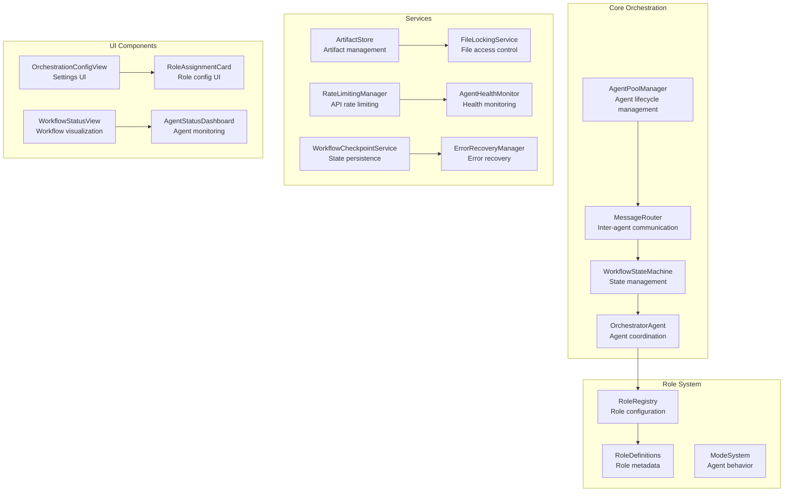
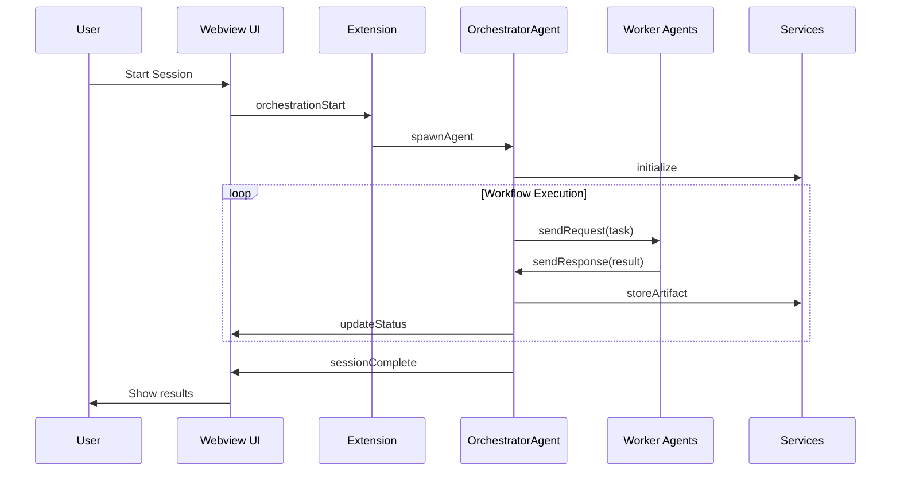

# Multi-Agent Orchestration System - Developer Documentation

## Architecture Overview

### System Components



### Data Flow



## Core Interfaces

### Agent Interfaces

#### AgentInstance Interface

```typescript
interface AgentInstance {
	id: string
	role: AgentRole
	status: AgentStatus
	process: ChildProcess
	health: HealthStatus
	lastHeartbeat: Date

	// Lifecycle methods
	spawn(): Promise<void>
	pause(): Promise<void>
	resume(): Promise<void>
	terminate(): Promise<void>

	// Communication methods
	send(message: AgentMessage): Promise<void>
	on(event: AgentEventType, handler: EventHandler): void

	// Health monitoring
	checkHealth(): Promise<HealthStatus>
	restart(): Promise<void>
}
```

#### AgentMessage Interface

```typescript
interface AgentMessage {
	id: string
	type: MessageType
	from: string
	to: string | null
	payload: AgentMessagePayload
	timestamp: Date
	correlationId?: string
}

interface AgentMessagePayload {
	type: string
	data: any
	metadata?: Record<string, any>
}
```

### Service Interfaces

#### ArtifactStore Interface

```typescript
interface ArtifactStore {
	storeArtifact(artifact: Artifact): Promise<ArtifactSummary>
	getArtifact(id: string): Promise<Artifact>
	updateArtifact(id: string, updates: Partial<Artifact>): Promise<Artifact>
	deleteArtifact(id: string): Promise<void>
	listArtifacts(filter?: ArtifactFilter): Promise<ArtifactSummary[]>

	// Advanced operations
	searchArtifacts(query: string): Promise<ArtifactSummary[]>
	archiveOldArtifacts(olderThan: Date): Promise<void>
	validateArtifact(artifact: Artifact): Promise<ValidationResult>
}
```

#### MessageRouter Interface

```typescript
interface MessageRouter {
	routeMessage(message: AgentMessage): Promise<void>
	sendRequest(to: string, payload: AgentMessagePayload, timeout?: number): Promise<AgentMessage>
	sendResponse(to: string, correlationId: string, payload: AgentMessagePayload): Promise<void>
	broadcast(from: string, payload: AgentMessagePayload): Promise<void>

	// Subscription management
	subscribe(agentId: string, filter: MessageFilter): void
	unsubscribe(agentId: string): void

	// Message management
	getMessageLog(filter?: MessageFilter): Promise<AgentMessage[]>
	clearMessageLog(): Promise<void>
}
```

## Role System

### Role Definitions

#### AgentRole Interface

```typescript
interface AgentRole {
	id: string
	name: string
	description: string
	category: RoleCategory
	required: boolean
	capabilities: string[]
	inputArtifacts: ArtifactType[]
	outputArtifacts: ArtifactType[]

	// Configuration
	defaultSettings: RoleSettings
	validationSchema: ZodSchema

	// Integration
	modeConfig: ModeConfig
	providerRequirements: ProviderRequirements
}
```

#### RoleRegistry Interface

```typescript
interface RoleRegistry {
	registerRole(role: AgentRole): void
	unregisterRole(roleId: string): void
	getRole(roleId: string): AgentRole | undefined
	listRoles(category?: RoleCategory): AgentRole[]

	// Configuration management
	configureRole(roleId: string, settings: Partial<RoleSettings>): void
	getRoleConfiguration(roleId: string): RoleSettings
	validateConfiguration(roleId: string, config: any): ValidationResult

	// Provider management
	assignProvider(roleId: string, providerId: string): void
	getProviderAssignment(roleId: string): string | undefined

	// Events
	on(event: RoleRegistryEvent, handler: EventHandler): void
}
```

### Mode System

#### ModeConfig Interface

```typescript
interface ModeConfig {
	id: string
	name: string
	description: string
	roleCompatibility: RoleCompatibility

	// Task handling
	canHandleTask(task: Task): boolean
	processTask(task: Task, context: ModeContext): Promise<ModeResult>

	// Artifact handling
	canProduceArtifact(artifactType: ArtifactType): boolean
	canConsumeArtifact(artifactType: ArtifactType): boolean

	// Communication
	handleMessage(message: AgentMessage): Promise<AgentMessage[]>
	handleRequest(request: TaskRequest): Promise<TaskResponse>
}
```

## Service Architecture

### Artifact Store

#### Storage Strategy

The Artifact Store uses a layered storage approach:

1. **Memory Cache**: Fast access for recent artifacts
2. **Local Storage**: Persistent storage for all artifacts
3. **Compression**: Automatic compression for large artifacts
4. **Indexing**: Full-text search and metadata indexing

#### Artifact Types

```typescript
enum ArtifactType {
	IMPLEMENTATION_PLAN = "implementation_plan",
	PSEUDOCODE = "pseudocode",
	CODE = "code",
	REVIEW_REPORT = "review_report",
	DOCUMENTATION = "documentation",
	TEST_RESULTS = "test_results",
	WORKFLOW_STATE = "workflow_state",
	AGENT_LOGS = "agent_logs",
}
```

#### Validation System

```typescript
interface ArtifactValidator {
	validateContent(artifact: Artifact): ValidationResult
	validateSchema(artifact: Artifact): ValidationResult
	validateIntegrity(artifact: Artifact): ValidationResult

	// Type-specific validation
	validateImplementationPlan(artifact: Artifact): ValidationResult
	validateCode(artifact: Artifact): ValidationResult
	validateDocumentation(artifact: Artifact): ValidationResult

	// Custom validation
	addCustomValidator(artifactType: ArtifactType, validator: CustomValidator): void
}
```

### Message Router

#### Routing Strategy

The Message Router uses a publish-subscribe pattern with filtering:

```typescript
interface MessageFilter {
	from?: string | string[]
	to?: string | string[]
	type?: MessageType | MessageType[]
	correlationId?: string
	metadata?: Record<string, any>
}
```

#### Message Queue

```typescript
interface MessageQueue {
	enqueue(message: AgentMessage): void
	dequeue(agentId: string): AgentMessage | null
	peek(agentId: string): AgentMessage | null
	clear(agentId: string): void

	// Priority management
	setPriority(message: AgentMessage, priority: number): void
	getPriority(message: AgentMessage): number
}
```

### Health Monitoring

#### Health Check System

```typescript
interface HealthCheck {
	type: HealthCheckType
	interval: number
	timeout: number
	maxFailures: number

	// Check execution
	execute(agent: AgentInstance): Promise<HealthCheckResult>

	// Recovery actions
	getRecoveryActions(failure: HealthCheckFailure): RecoveryAction[]
}
```

#### Health Status

```typescript
enum HealthStatus {
	HEALTHY = "healthy",
	UNHEALTHY = "unhealthy",
	UNKNOWN = "unknown",
	RESTARTING = "restarting",
	TERMINATED = "terminated",
}
```

## Workflow Management

### State Machine

#### Workflow States

```typescript
enum WorkflowState {
	IDLE = "idle",
	PLANNING = "planning",
	PLAN_REVIEW = "plan_review",
	STRUCTURE_CREATION = "structure_creation",
	IMPLEMENTATION = "implementation",
	REVIEW = "review",
	DOCUMENTATION = "documentation",
	TESTING = "testing",
	COMPLETION = "completion",
	FAILED = "failed",
	CANCELLED = "cancelled",
}
```

#### State Transitions

```typescript
interface StateTransition {
	from: WorkflowState
	to: WorkflowState
	conditions: TransitionCondition[]
	actions: TransitionAction[]
	guards: TransitionGuard[]
}
```

### Checkpoint System

#### Checkpoint Management

```typescript
interface WorkflowCheckpoint {
	id: string
	workflowId: string
	state: WorkflowState
	data: any
	createdAt: Date
	expiresAt?: Date

	// Metadata
	createdBy: string
	description: string
	tags: string[]
}
```

#### Checkpoint Strategy

```typescript
interface CheckpointStrategy {
	shouldCreateCheckpoint(state: WorkflowState): boolean
	shouldRestoreCheckpoint(failure: Error): boolean
	cleanupCheckpoints(checkpoints: WorkflowCheckpoint[]): void

	// Configuration
	setAutoCheckpoint(enabled: boolean): void
	setCheckpointInterval(interval: number): void
	setMaxCheckpoints(max: number): void
}
```

## Error Handling

### Error Recovery

#### Recovery Strategies

```typescript
enum RecoveryStrategy {
	RETRY = "retry",
	REASSIGN = "reassign",
	ROLLBACK = "rollback",
	DEGRADE = "degrade",
	NOTIFY = "notify",
	ABANDON = "abandon",
}
```

#### Error Recovery Manager

```typescript
interface ErrorRecoveryManager {
	handle(error: Error, context: RecoveryContext): Promise<RecoveryResult>

	// Strategy management
	registerStrategy(strategy: RecoveryStrategy, handler: RecoveryHandler): void
	getStrategyForError(error: Error): RecoveryStrategy

	// Circuit breaker
	isCircuitOpen(errorType: string): boolean
	openCircuit(errorType: string, duration: number): void
	closeCircuit(errorType: string): void
}
```

### Error Types

```typescript
enum OrchestrationError {
	AGENT_UNRESPONSIVE = "agent_unresponsive",
	RATE_LIMIT_EXCEEDED = "rate_limit_exceeded",
	FILE_LOCK_CONFLICT = "file_lock_conflict",
	CONTEXT_LIMIT_REACHED = "context_limit_reached",
	ARTIFACT_VALIDATION_FAILED = "artifact_validation_failed",
	WORKFLOW_TRANSITION_FAILED = "workflow_transition_failed",
	PROVIDER_CONNECTION_FAILED = "provider_connection_failed",
}
```

## API Reference

### Core API

#### AgentPoolManager API

```typescript
class AgentPoolManager {
	// Agent lifecycle
	spawnAgent(role: AgentRole, config: AgentConfig): Promise<AgentInstance>
	getAgent(agentId: string): AgentInstance | undefined
	getActiveAgents(): AgentInstance[]
	pauseAgent(agentId: string): Promise<void>
	resumeAgent(agentId: string): Promise<void>
	terminateAgent(agentId: string): Promise<void>

	// Configuration
	setConcurrentLimit(limit: number): void
	getConcurrentLimit(): number

	// Events
	on(event: AgentPoolEvent, handler: EventHandler): void
}
```

#### MessageRouter API

```typescript
class MessageRouter {
	// Message routing
	routeMessage(message: AgentMessage): Promise<void>
	sendRequest(to: string, payload: AgentMessagePayload, timeout?: number): Promise<AgentMessage>
	sendResponse(to: string, correlationId: string, payload: AgentMessagePayload): Promise<void>
	broadcast(from: string, payload: AgentMessagePayload): Promise<void>

	// Subscription management
	subscribe(agentId: string, filter: MessageFilter): void
	unsubscribe(agentId: string): void

	// Message management
	getMessageLog(filter?: MessageFilter): Promise<AgentMessage[]>
	clearMessageLog(): Promise<void>
}
```

#### WorkflowStateMachine API

```typescript
class WorkflowStateMachine {
	// State management
	getCurrentState(): WorkflowState
	transitionTo(state: WorkflowState): Promise<void>
	canTransitionTo(state: WorkflowState): boolean

	// History management
	getStateHistory(): WorkflowState[]
	getCurrentCheckpoint(): WorkflowCheckpoint | null

	// Events
	on(event: WorkflowEvent, handler: EventHandler): void
}
```

### Service APIs

#### ArtifactStore API

```typescript
class ArtifactStore {
	// Basic operations
	storeArtifact(artifact: Artifact): Promise<ArtifactSummary>
	getArtifact(id: string): Promise<Artifact>
	updateArtifact(id: string, updates: Partial<Artifact>): Promise<Artifact>
	deleteArtifact(id: string): Promise<void>
	listArtifacts(filter?: ArtifactFilter): Promise<ArtifactSummary[]>

	// Advanced operations
	searchArtifacts(query: string): Promise<ArtifactSummary[]>
	archiveOldArtifacts(olderThan: Date): Promise<void>
	validateArtifact(artifact: Artifact): Promise<ValidationResult>
}
```

#### FileLockingService API

```typescript
class FileLockingService {
	// Lock management
	acquireLock(filePath: string, options?: LockOptions): Promise<LockHandle>
	releaseLock(handle: LockHandle): Promise<void>
	getLockStatus(filePath: string): LockStatus

	// Conflict management
	detectConflicts(filePath: string): LockConflict[]
	resolveConflict(conflict: LockConflict): Promise<Resolution>
}
```

#### RateLimitingManager API

```typescript
class RateLimitingManager {
	// Request management
	queueRequest(request: Request): Promise<void>
	processRequest(request: Request): Promise<Response>
	cancelRequest(requestId: string): Promise<void>

	// Rate limiting
	isRateLimited(provider: string): boolean
	getRateLimitInfo(provider: string): RateLimitInfo
	resetRateLimit(provider: string): void

	// Circuit breaker
	isOpen(provider: string): boolean
	openCircuit(provider: string, duration: number): void
	closeCircuit(provider: string): void
}
```

## Configuration API

### Role Configuration API

```typescript
class RoleConfiguration {
	// Role management
	getRole(roleId: string): AgentRole | undefined
	configureRole(roleId: string, settings: Partial<RoleSettings>): void
	validateRoleConfiguration(roleId: string, config: any): ValidationResult

	// Provider management
	assignProvider(roleId: string, providerId: string): void
	getProviderAssignment(roleId: string): string | undefined

	// Events
	on(event: RoleConfigEvent, handler: EventHandler): void
}
```

### Workflow Configuration API

```typescript
class WorkflowConfiguration {
	// Workflow management
	createWorkflow(config: WorkflowConfig): Workflow
	getWorkflow(workflowId: string): Workflow | undefined
	updateWorkflow(workflowId: string, updates: Partial<WorkflowConfig>): void
	deleteWorkflow(workflowId: string): void

	// Template management
	saveTemplate(template: WorkflowTemplate): void
	getTemplate(templateId: string): WorkflowTemplate | undefined
	listTemplates(): WorkflowTemplate[]
}
```

## Testing API

### Test Framework Integration

```typescript
class OrchestrationTestFramework {
	// Test creation
	createAgentTest(testConfig: AgentTestConfig): AgentTest
	createWorkflowTest(testConfig: WorkflowTestConfig): WorkflowTest
	createIntegrationTest(testConfig: IntegrationTestConfig): IntegrationTest

	// Test execution
	runTest(test: Test): Promise<TestResult>
	runTests(tests: Test[]): Promise<TestResult[]>

	// Test utilities
	createMockAgent(role: AgentRole): MockAgent
	createMockMessageRouter(): MockMessageRouter
	createMockArtifactStore(): MockArtifactStore
}
```

### Mock Services

```typescript
class MockAgent implements AgentInstance {
	// Mock implementation of AgentInstance
	spawn(): Promise<void>
	send(message: AgentMessage): Promise<void>
	on(event: AgentEventType, handler: EventHandler): void

	// Test utilities
	simulateResponse(response: AgentMessage): void
	simulateError(error: Error): void
	getReceivedMessages(): AgentMessage[]
}
```

## Performance Monitoring

### Metrics Collection

```typescript
class PerformanceMonitor {
	// Agent metrics
	trackAgentSpawnTime(agentId: string, duration: number): void
	trackAgentResponseTime(agentId: string, duration: number): void
	trackAgentMemoryUsage(agentId: string, memory: number): void

	// Workflow metrics
	trackWorkflowDuration(workflowId: string, duration: number): void
	trackArtifactCreationTime(artifactType: ArtifactType, duration: number): void
	trackMessageProcessingTime(duration: number): void

	// Service metrics
	trackStorageOperation(type: string, duration: number): void
	trackRateLimitWait(time: number): void
	trackHealthCheckTime(duration: number): void
}
```

### Monitoring API

```typescript
class MonitoringAPI {
	// Metrics retrieval
	getAgentMetrics(agentId: string): AgentMetrics
	getWorkflowMetrics(workflowId: string): WorkflowMetrics
	getServiceMetrics(serviceId: string): ServiceMetrics

	// Alerting
	setAlertThreshold(metric: string, threshold: number): void
	getAlerts(): Alert[]
	clearAlerts(): void

	// Reporting
	generatePerformanceReport(period: DateRange): PerformanceReport
	exportMetrics(format: "json" | "csv"): string
}
```

## Security Considerations

### Access Control

```typescript
class AccessControl {
	// Permission management
	checkPermission(agentId: string, action: string, resource: string): boolean
	grantPermission(agentId: string, action: string, resource: string): void
	revokePermission(agentId: string, action: string, resource: string): void

	// Role-based access
	getAgentPermissions(agentId: string): Permission[]
	getRolePermissions(roleId: string): Permission[]

	// Security events
	on(event: SecurityEvent, handler: EventHandler): void
}
```

### Data Validation

```typescript
class SecurityValidator {
	// Input validation
	validateAgentMessage(message: AgentMessage): ValidationResult
	validateArtifact(artifact: Artifact): ValidationResult
	validateConfiguration(config: any): ValidationResult

	// Sanitization
	sanitizeInput(input: string): string
	sanitizeCode(code: string): string
	sanitizeArtifactContent(content: string): string

	// Security scanning
	scanForVulnerabilities(code: string): Vulnerability[]
	scanForMaliciousContent(content: string): boolean
}
```

## Extension Points

### Custom Role Development

```typescript
class CustomRole implements AgentRole {
	// Required properties
	id: string
	name: string
	description: string
	category: RoleCategory
	required: boolean
	capabilities: string[]
	inputArtifacts: ArtifactType[]
	outputArtifacts: ArtifactType[]

	// Custom behavior
	processTask(task: Task, context: ModeContext): Promise<ModeResult>
	validateTask(task: Task): ValidationResult

	// Integration
	getModeConfig(): ModeConfig
	getProviderRequirements(): ProviderRequirements
}
```

### Custom Mode Development

```typescript
class CustomMode implements ModeConfig {
	// Required properties
	id: string
	name: string
	description: string
	roleCompatibility: RoleCompatibility

	// Task handling
	canHandleTask(task: Task): boolean
	processTask(task: Task, context: ModeContext): Promise<ModeResult>

	// Artifact handling
	canProduceArtifact(artifactType: ArtifactType): boolean
	canConsumeArtifact(artifactType: ArtifactType): boolean

	// Communication
	handleMessage(message: AgentMessage): Promise<AgentMessage[]>
	handleRequest(request: TaskRequest): Promise<TaskResponse>
}
```

## Development Workflow

### Setting Up Development Environment

```bash
# Clone the repository
git clone https://github.com/Kilo-Org/kilocode.git
cd kilocode

# Install dependencies
pnpm install

# Build the extension
pnpm build

# Start development server
pnpm dev

# Run tests
pnpm test
```

### Running Tests

```bash
# Run all tests
pnpm test

# Run specific test suite
pnpm test src/core/kilocode/agent-manager/orchestration/__tests__/AgentPoolManager.spec.ts

# Run tests in watch mode
pnpm test --watch

# Run tests with coverage
pnpm test --coverage
```

### Debugging

```bash
# Enable debug logging
export DEBUG=kilo:orchestration

# Start with debug mode
pnpm dev --debug

# Debug specific component
export DEBUG=kilo:orchestration:AgentPoolManager
```

## Contributing Guidelines

### Code Style

- Follow existing code patterns
- Use TypeScript for all new code
- Write comprehensive tests
- Add proper documentation

### Pull Request Process

1. Fork the repository
2. Create feature branch
3. Make changes with tests
4. Update documentation
5. Submit pull request
6. Address review comments

### Release Process

1. Update version in package.json
2. Update CHANGELOG.md
3. Create changeset
4. Run release script
5. Publish to marketplace

## Version History

### Version 5.5.0

- Enhanced API documentation
- Improved error handling
- Added custom role development guide

### Version 5.4.0

- Initial developer documentation
- Core API reference
- Testing framework documentation

### Version 5.3.0

- Architecture overview
- Basic component documentation

## Support and Resources

### Documentation

- [User Guide](user-guide.md)
- [API Reference](api-reference.md)
- [Troubleshooting](troubleshooting.md)

### Community

- [Discord Community](https://kilo.ai/discord)
- [GitHub Issues](https://github.com/Kilo-Org/kilocode/issues)
- [Discussions](https://github.com/Kilo-Org/kilocode/discussions)

### Professional Support

- [Enterprise Support](https://kilo.ai/support)
- [Consulting Services](https://kilo.ai/consulting)
- [Training Programs](https://kilo.ai/training)

---

**Last Updated**: 2026-02-15  
**Version**: 5.5.0  
**Documentation**: [Developer Documentation](developer-documentation.md)
